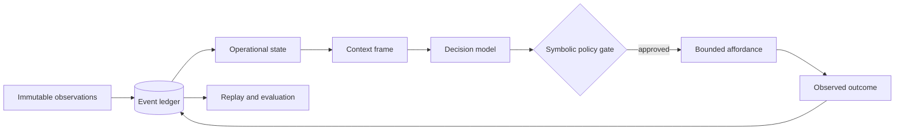

# Blackcell

[](https://github.com/kmosoti/blackcell/actions/workflows/ci.yml)
[](https://www.python.org/downloads/)
[](LICENSE)

**Event-sourced control runtime for evidence-grounded LLM agents.**

Blackcell is a local-first control boundary around agentic models. It turns immutable evidence
into inspectable operational state and context, accepts typed proposals from a replaceable model,
gates actions through developer-authored policy, executes bounded affordances, and records what
actually happened for replay and evaluation.

> [!NOTE]
> Runtime-v1 is evidence-complete and unpublished. The repository contains an inspectable release
> candidate, not a published package, image, tag, signature, attestation, or vulnerability report.

## Quickstart

You need Git, Python 3.14, and [`uv`](https://docs.astral.sh/uv/). The maintained walkthrough uses
the deterministic recorded model: it requires no credentials, performs no live model call, and
keeps all temporary state outside the checkout.

```bash
git clone https://github.com/kmosoti/blackcell.git
cd blackcell
uv sync --locked --all-groups
bash examples/runtime-v1/recorded-operator.sh
```

Expected result:

```json
{"replay": "completed", "run": "completed", "schema_version": "runtime-v1-recorded-example/v1", "state_projected": true, "workflow_version": "daily-operator/v2"}
```

The example creates an isolated Git repository, completes one Repository Operator loop, projects
state, verifies live-free replay, and removes its temporary data when it exits.

## Why Blackcell

Most agent frameworks begin with a model loop and tool access. Blackcell begins with the evidence
and control boundary around that loop:

- **Evidence before assertion:** conflicts, unknowns, provenance, and effective time remain visible.
- **Inspectable context:** every selected or omitted item can be traced to recorded evidence.
- **Bounded authority:** the model proposes; typed policy, approval, and affordances decide what runs.
- **Observed outcomes:** predictions and actual effects are recorded independently.
- **Live-free replay:** historical runs can be reconstructed without calling a model or repeating a
  side effect.

The model is replaceable. Blackcell remains the state store, policy gate, executor, and evaluator.

## How it works



The Repository Operator composes this path over the canonical `daily-operator/v2` workflow. The
same event and artifact boundaries support the local API, durable worker, scheduler, telemetry,
quotas, and verified recovery without giving a model ambient tool authority.

## Core workflows

| Goal | Command |
| --- | --- |
| Run one credential-free operator loop | `uv run blackcell operator run --model recorded --repo .` |
| Inspect projected state | `uv run blackcell operator state --repo .` |
| Inspect the exact context used by a run | `uv run blackcell operator context --repo .` |
| Replay the latest run without live effects | `uv run blackcell operator replay --repo .` |
| Inspect immutable events | `uv run blackcell events list --repo .` |
| List and validate OperatorBench fixtures | `uv run blackcell bench list` / `uv run blackcell bench run --condition structured --trials 1` |
| Run the recorded context comparison | `uv run blackcell bench compare --model recorded` |
| Run deterministic prediction baselines | `uv run blackcell bench predict` |
| Profile runtime acceptance paths | `uv run blackcell bench runtime --repo-root .` |

Successful commands emit JSON by default. Add `--jsonl` for record streams or `--rich` for
operator-facing tables. A live Codex route is always explicit and uses the local Codex CLI model
boundary; tool authority remains inside Blackcell.

Recorded benchmark modes validate fixtures, identities, grading, and comparison mechanics. They
do not establish a live-model context or retrieval effect. Runtime benchmark timings are retained
reliability evidence, not throughput, capacity, recovery, or service-level objectives.

## Runtime-v1 evidence

The unpublished bundle under [`release/runtime-v1/`](release/runtime-v1/) contains a deterministic
CycloneDX 1.7 pre-build Python-runtime SBOM and a verification manifest that binds the declared
source, tests, documentation, examples, experiments, and retained runtime evidence by SHA-256.

Verify the candidate without rewriting it:

```bash
uv run python tools/release_evidence.py verify --repo-root .
```

See the [runtime-v1 release guide](docs/guides/runtime-v1-release.md) for the recorded walkthrough,
rootless API and worker boundary, recovery procedure, SBOM scope, and exact publication non-claims.

## Scientific boundary

Blackcell implements an operational state estimator and a replaceable proposal mechanism with
symbolic validation. It does not claim a POMDP belief state, learned world model, JEPA architecture,
causal understanding, or a neuro-symbolic reasoning contribution.

The runtime records state, action, expected effect, observed outcome, and residual tuples. A learned
transition model becomes eligible only after those records support held-out comparison against
persistence, symbolic, empirical, and LLM-only baselines.

## Documentation

| Start here | Purpose |
| --- | --- |
| [Runtime-v1 release guide](docs/guides/runtime-v1-release.md) | Credential-free walkthrough and runtime boundaries |
| [Charter](docs/charter.md) | Product identity, scope, acceptance, and claim gates |
| [Architecture](docs/architecture.md) | Event, state, execution, replay, service, and recovery design |
| [Scientific basis](docs/scientific-basis.md) | Terminology and evidence required to promote research claims |
| [Evaluation methodology](docs/evaluation-methodology.md) | OperatorBench, PredictionBench, and RuntimeBench contracts |
| [Documentation map](docs/index.md) | Canonical graph, ADRs, specifications, targets, and research |

## Development

Install the locked development environment and run the repository gates:

```bash
uv sync --locked --all-groups
uv run ruff format --check .
uv run ruff check .
uv run ty check
uv run pytest --cov=blackcell --cov-report=term-missing
```

Use [GitHub Issues](https://github.com/kmosoti/blackcell/issues) for bugs and feature requests.

## License

Blackcell is available under the [MIT License](LICENSE).
