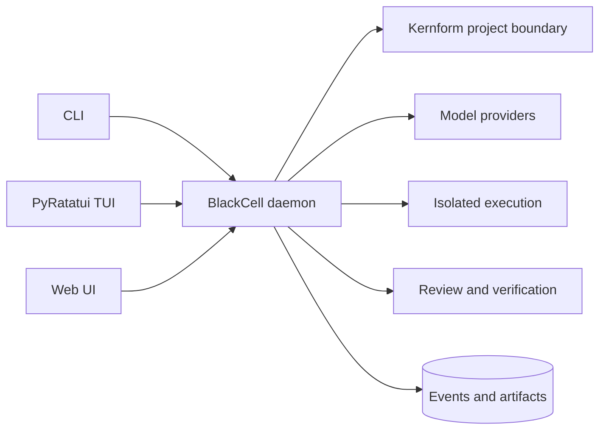

# Blackcell

[](https://github.com/kmosoti/blackcell/actions/workflows/ci.yml)
[](https://www.python.org/downloads/)
[](LICENSE)

**CLI-first, project-scoped agentic framework with durable review and verification.**

BlackCell is being built around one local daemon that turns project intent and repository evidence
into typed plans, bounded execution, independent review, verified outcomes, and replayable records.
The JSON-first CLI is the complete automation surface; the packaged PyRatatui TUI and Litestar web
UI are clients of the same versioned service.

> [!NOTE]
> The alpha project loop is under active implementation. `DailyOperatorV2Workflow` and the legacy
> synchronous run route are retained as migration/replay evidence, not as the alpha execution path.

## Development bootstrap

You need Git, Python 3.14, and [`uv`](https://docs.astral.sh/uv/).

```bash
git clone https://github.com/kmosoti/blackcell.git
cd blackcell
uv sync --locked --all-groups
uv run blackcell --help
```

## Why Blackcell

Most agent frameworks begin with a model loop and tool access. Blackcell begins with the evidence
and control boundary around that loop:

- **Evidence before assertion:** conflicts, unknowns, provenance, and effective time remain visible.
- **Inspectable context:** every selected or omitted item can be traced to recorded evidence.
- **Bounded authority:** the model proposes; typed policy, approval, and affordances decide what runs.
- **Observed outcomes:** predictions and actual effects are recorded independently.
- **Live-free replay:** historical runs can be reconstructed without calling a model or repeating a
  side effect.
- **Separate assurance roles:** prediction is advisory, review searches for defects, and
  verification adjudicates declared outcomes.

Models are replaceable proposal mechanisms. The daemon remains the state store, scheduler, policy
gate, execution coordinator, and source of authoritative outcomes.

## Alpha architecture



The daemon runs in the foreground and may be supervised by an operating-system service manager.
Clients never embed a second scheduler or read mutable storage directly. Kernform is invoked only
through its pinned agent-mode JSON command contract; BlackCell does not import Kernform internals.

## Current surfaces

| Goal | Command |
| --- | --- |
| Inspect CLI commands | `uv run blackcell --help` |
| Run the daemon in the foreground | `uv run blackcell daemon foreground` |
| Enable alpha dispatch | Set `BLACKCELL_ALPHA_WORKER_CONFIG_FILE` to an absolute owner-only JSON contract before starting the daemon |
| Install the optional user service | `uv run blackcell daemon install --environment-file ~/.config/blackcell/runtime.env` |
| Start or inspect the daemon | `uv run blackcell daemon start`; `uv run blackcell daemon status` |
| Read bounded daemon logs | `uv run blackcell daemon logs --lines 100` |
| Check a Kernform-managed project | `uv run blackcell project check --path .` |
| Initialize project configuration | `uv run blackcell project init NAME --destination PATH` |
| Use the authenticated alpha API | `POST /api/alpha/v1/projects`, `/intents`, `/plans`, then `/runs` |
| Resume alpha state reads | `GET /api/alpha/v1/events?after=CURSOR`, run `status`, or run `replay` |
| Open the packaged browser client | `http://127.0.0.1:8080/alpha` while the daemon is running |
| Open the packaged terminal client | `uv run blackcell alpha tui` with the endpoint and token environment set |
| Inspect the active alpha DAG | `alpha.plan.yaml` |
| Verify historical runtime evidence | `bash examples/runtime-v1/recorded-operator.sh` |

Successful commands emit JSON by default. Add `--jsonl` for record streams or `--rich` for
operator-facing tables. The A03 HTTP core now accepts immutable project, intent, and plan contracts
and returns `202 Accepted` after durably queueing a run. It exposes status, cursor-based events, and
live-free replay without calling the legacy V2 route. The daemon starts API-only by default, so a
run remains `queued` until an explicit `blackcell.alpha-worker-config/v1` file enables the alpha
worker. That owner-only file lives outside the repository and fixes the model route, provider
environment-variable names, executable identities, isolation roots, aliases, and resource limits;
invalid or incomplete configuration stops startup without falling back to the legacy worker.
See the [alpha worker configuration guide](docs/guides/alpha-worker-configuration.md) for the closed
JSON shape, path permissions, provider environment allowlist, and fast `--once` diagnostic.
Use the [alpha operator quickstart](docs/guides/alpha-operator-quickstart.md) for the exact secure
foreground environment, checked request templates, CLI/browser submission order, cancellation,
restart, and replay flow. Independent assurance configuration is split between the
[review guide](docs/guides/alpha-review-configuration.md) and deterministic
[verification guide](docs/guides/alpha-verify-configuration.md).

`daemon install` reads no credential value and never creates an environment file. Supply an
existing absolute, owner-only mode-`0600` file containing the runtime configuration. Installation
enables one foreground `blackcell.service` user unit but does not start it.

## Runtime-v1 evidence

The unpublished bundle under [`release/runtime-v1/`](release/runtime-v1/) contains a deterministic
CycloneDX 1.7 pre-build Python-runtime SBOM and a verification manifest that binds the declared
source, tests, documentation, examples, experiments, and retained runtime evidence by SHA-256.

Verify the candidate without rewriting it:

```bash
uv run python tools/release_evidence.py verify --repo-root .
```

See the [runtime-v1 release guide](docs/guides/runtime-v1-release.md) for the recorded walkthrough,
rootless API and worker boundary, recovery procedure, SBOM scope, and exact publication non-claims.

The credential-free historical walkthrough remains available for migration verification:

```bash
bash examples/runtime-v1/recorded-operator.sh
```

Expected result:

```json
{"replay": "completed", "run": "completed", "schema_version": "runtime-v1-recorded-example/v1", "state_projected": true, "workflow_version": "daily-operator/v2"}
```

## Scientific boundary

Blackcell implements an operational state estimator and a replaceable proposal mechanism with
symbolic validation. It does not claim a POMDP belief state, learned world model, JEPA architecture,
causal understanding, or a neuro-symbolic reasoning contribution.

It does not yet claim a complete project implementation runtime, sandboxed worktree executor,
reward-hack-resistant reviewer, or calibrated predictive risk model. The active
[alpha plan](alpha.plan.yaml) names the acceptance evidence required before those capabilities are
promoted.

The runtime records state, action, expected effect, observed outcome, and residual tuples. A learned
transition model becomes eligible only after those records support held-out comparison against
persistence, symbolic, empirical, and LLM-only baselines.

## Documentation

| Start here | Purpose |
| --- | --- |
| [Alpha operator quickstart](docs/guides/alpha-operator-quickstart.md) | Source-run daemon, checked requests, CLI/browser workflow, restart, and current nonclaims |
| [Runtime-v1 release guide](docs/guides/runtime-v1-release.md) | Credential-free walkthrough and runtime boundaries |
| [Alpha plan](alpha.plan.yaml) | Active work packages, dependency DAG, architecture, and fast gates |
| [Charter](docs/charter.md) | Product identity, scope, acceptance, and claim gates |
| [Product scope](docs/scope.md) | Accepted target, current boundary, non-goals, and promotion rules |
| [Architecture](docs/architecture.md) | Event, state, execution, replay, service, and recovery design |
| [Scientific basis](docs/scientific-basis.md) | Terminology and evidence required to promote research claims |
| [Evaluation methodology](docs/evaluation-methodology.md) | OperatorBench, PredictionBench, and RuntimeBench contracts |
| [Documentation map](docs/index.md) | Canonical graph, ADRs, specifications, targets, and research |

## Development

Install the locked development environment, then use exact affected tests while iterating:

```bash
uv sync --locked --all-groups
uv run python tools/run_pytest.py path/to/test.py::test_name -q --blackcell-require-all-pass
uv run ruff check path/to/changed.py path/to/test_changed.py
uv run ruff format --check path/to/changed.py path/to/test_changed.py
```

Use `uv run ruff check .` as the fast milestone gate. CI owns broad coverage and type checking;
reserve a local full suite for release/publication or changes whose risk cannot be bounded by
focused evidence.

Use [GitHub Issues](https://github.com/kmosoti/blackcell/issues) for bugs and feature requests.

## License

Blackcell is available under the [MIT License](LICENSE).
