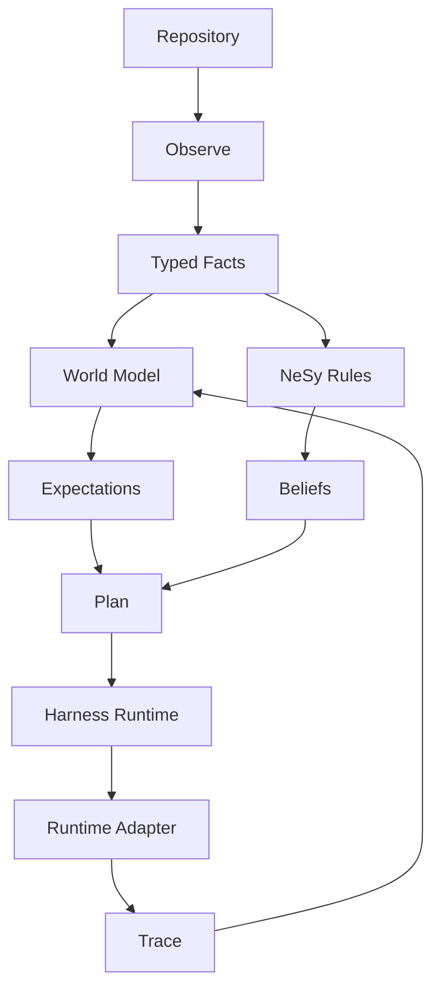

# BlackCell

BlackCell is an experimental world-model harness for software work.

The core idea is simple: observe a repository, turn evidence into typed facts,
reason over lightweight symbolic constraints, plan agent work through a runtime-
agnostic harness, and keep an explicit trace of what happened.

## What I Am Trying

I want a software workflow that behaves less like a pile of prompts and more
like a small cognitive loop:

- observe the repo
- maintain a compact internal model
- express constraints explicitly
- dispatch through interchangeable runtimes
- record traces, surprises, and revisions

The first slice is intentionally light on ML. BlackCell starts with typed world
state, NeSy scaffolding, runtime adapters, and traceable planning rather than a
heavy differentiable stack.

## Framework



## First Experiment

```bash
uv run blackcell world observe
uv run blackcell nesy validate
uv run blackcell harness plan
uv run blackcell harness run --runtime dry-run
```

## Deeper Docs

- `docs/index.md`
- `docs/atlas/graph.md`
- `docs/concepts/world-model.md`
- `docs/concepts/nesy.md`
- `docs/concepts/harness.md`
- `docs/concepts/custom-agents.md`
- `docs/targets/opencode.md`
- `docs/targets/containers.md`
