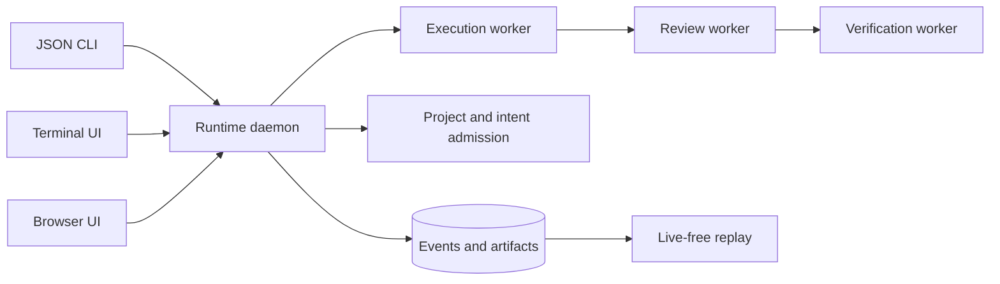

# BlackCell

[](https://github.com/kmosoti/blackcell/actions/workflows/ci.yml)
[](https://www.python.org/downloads/)
[](LICENSE)

**CLI-first, project-scoped software execution with durable review and verification.**

BlackCell turns explicit project intent and repository evidence into a dependency-safe plan,
bounded execution, independent review, deterministic verification, and live-free replay. One local
daemon owns state, scheduling, policy, providers, recovery, and ordered events. The JSON-first CLI,
terminal UI, and browser UI are clients of that service.

## Why BlackCell

Most agent frameworks begin with a model loop and tool access. BlackCell begins with the evidence
and authority boundary around that loop:

- Evidence retains provenance, conflicts, unknowns, effective time, and content identity.
- Models propose; host-owned contracts decide what can run.
- Plans bind dependencies, effects, repository paths, budgets, and acceptance commands.
- Execution uses fenced claims, isolated worktrees, bounded processes, and durable transitions.
- Review searches for defects and epistemic overreach without changing the acceptance contract.
- Verification maps every declared outcome to deterministic evidence and preserves uncertainty.
- Replay reconstructs a run without calling a model or repeating repository effects.

## Architecture


```mermaid
flowchart LR
    C[JSON CLI] --> D[Runtime daemon]
    T[Terminal UI] --> D
    W[Browser UI] --> D
    D --> K[(Events and artifacts)]
    D --> P[Project and intent admission]
    D --> E[Execution worker]
    E --> R[Review worker]
    R --> V[Verification worker]
    K --> X[Live-free replay]
```

Clients never embed a scheduler or read mutable storage directly. Worker configuration is opt-in,
owner-only, and fail closed. Execution, review, and verification have distinct processes,
configuration files, identities, streams, and authority.

## Development bootstrap

You need Git, Python 3.14, and [`uv`](https://docs.astral.sh/uv/).

```bash
git clone https://github.com/kmosoti/blackcell.git
cd blackcell
uv sync --locked --all-groups
uv run blackcell --help
```

Validate the checked request contracts without starting a service or invoking a provider:

```bash
bash examples/runtime/validate-contracts.sh
```

Expected output:

```json
{"contracts": ["project", "intent", "plan", "run", "query", "cancel"], "schema_version": "runtime-contract-example", "status": "valid"}
```

## Runtime surfaces

| Goal | Surface |
| --- | --- |
| Run the daemon in the foreground | `uv run blackcell daemon foreground` |
| Inspect readiness | `uv run blackcell daemon status` |
| Register a project | `uv run blackcell project register --request project.json` |
| Accept intent | `uv run blackcell intent accept --request intent.json` |
| Accept a plan | `uv run blackcell plan accept --request plan.json` |
| Submit a run | `uv run blackcell run submit --request run.json` |
| Inspect or query runs | `uv run blackcell run status RUN_ID`; `uv run blackcell run query --request query.json` |
| Cancel or replay | `uv run blackcell run cancel RUN_ID --request cancel.json`; `uv run blackcell run replay RUN_ID` |
| Resume ordered events | `uv run blackcell events list --after 0 --limit 100` |
| Inspect model CLI authority and transport | `uv run blackcell adapters inspect` |
| Open the terminal client | `uv run blackcell tui` |
| Open the browser client | `http://127.0.0.1:8080/ui` |

The typed HTTP boundary uses `/api/v1/projects`, `/intents`, `/plans`, `/runs`, and `/events`, plus
the same-origin `/api/v1/ui` support routes. Those revision tokens are public protocol contracts;
internal modules and symbols use capability names instead of product maturity or generation labels.

Set `BLACKCELL_EXECUTION_CONFIG_FILE`, `BLACKCELL_REVIEW_CONFIG_FILE`, and
`BLACKCELL_VERIFICATION_CONFIG_FILE` only for workers that should run. Without them, the daemon is
API-only and submitted work remains queued. Incompatible persisted state is rejected before a
write-capable connection is opened; BlackCell does not migrate or delete it automatically.

## Epistemic guard

Review and verification use a closed nine-dimension matrix covering acceptance, evidence,
counterevidence, causality, scope, uncertainty, provenance freshness, independent corroboration,
and order sensitivity. Findings must cite admitted evidence. Missing evidence remains unknown and
produces an inconclusive verification result rather than model-authored certainty. Human acceptance
stays separate from both model review and deterministic verification.

See [Epistemic evaluation](docs/epistemic-evaluation.md) for the research basis, threat model, and
matrix contract.

## Documentation

| Start here | Purpose |
| --- | --- |
| [Runtime quickstart](docs/guides/runtime-quickstart.md) | Secure daemon, request, client, restart, and recovery flow |
| [Execution model](docs/guides/execution.md) | Plan admission, execution lifecycle, review, verification, and replay |
| [Execution worker configuration](docs/guides/execution-worker-configuration.md) | Provider, worktree, isolation, and resource authority |
| [Review configuration](docs/guides/review-configuration.md) | Separate review provider, identity, budget, and process |
| [Verification configuration](docs/guides/verification-configuration.md) | Deterministic verification identity and lifecycle |
| [Charter](docs/charter.md) | Product identity, authority, and claim gates |
| [Scope](docs/scope.md) | Current product boundary and non-goals |
| [Architecture](docs/architecture.md) | Runtime ownership, persistence, clients, and recovery |
| [Documentation map](docs/index.md) | Canonical guides, decisions, specifications, and research |

## Development

Use exact affected nodes during iteration and run tests through the repository wrapper:

```bash
uv run python tools/run_pytest.py path/to/test.py::test_name -q --blackcell-require-all-pass
uv run ruff format --check path/to/changed.py path/to/test_changed.py
uv run ruff check path/to/changed.py path/to/test_changed.py
```

CI runs architecture fitness, formatting, linting, type checking, and the complete coverage gate.
It does not generate or validate source-bound release artifacts.

## License

MIT. See [LICENSE](LICENSE).
