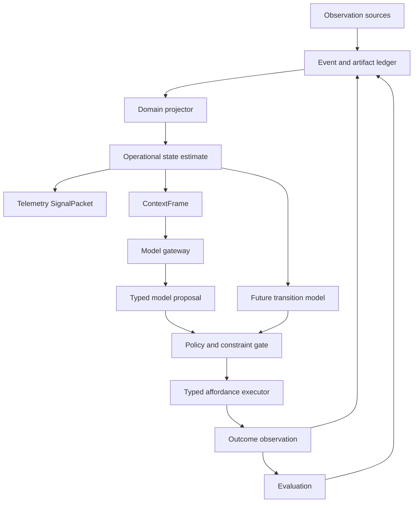

# Runtime Architecture

## Architectural style

Blackcell is a modular monolith with Clean/Onion dependency direction, vertical feature slices,
and an event-driven kernel. These patterns apply at different scales: dependency direction keeps
policy independent from frameworks, slices keep behavior cohesive, and events make accepted state
transitions durable and replayable. The initial runtime uses in-process dispatch and SQLite; it
does not simulate maturity by requiring a distributed broker.

The model gateway, persistence, retrieval, solvers, execution, telemetry, and HTTP server are edge
adapters. Workflows coordinate feature ports. Only bootstrap code assembles concrete dependencies.

## Boundaries

Blackcell keeps one immutable evidence ledger and multiple domain-scoped projectors. A
repository, personal work queue, and telemetry system do not share one universal state
schema, transition model, action space, horizon, or objective. ContextFrames may compose
state estimates across domains, but prediction and control remain bounded by domain.



Durable multi-agent orchestration is a consumer of these same boundaries, not a separate agent
runtime. DAG nodes invoke typed workflow or feature ports; their attempts, leases, results, and
evaluations append to the same ledger and share the same authorization path.

Runtime DAG definitions are immutable and content-addressed. Every node declares a handler port,
principal and role, typed input bindings and output schema, dependency set, retry policy, timeout,
token/latency/cost budget, side-effect class, required reviewer/verifier approvals, gateway
capability, classification, locality, and determinism requirement. Validation establishes a stable
topological order and rejects missing edges, cycles, schema drift, self-approval, irreversible
scheduler authority, and role-policy violations before any work can be submitted.

Planner, executor, reviewer, verifier, and synthesizer profiles are separate gateway-policy
boundaries. Only executors may declare effects; verifiers are local and deterministic; reviewer or
verifier roles may approve bounded reversible work; synthesizers have no authority to override a
symbolic denial. These are runtime contracts under `blackcell.orchestration`, distinct from the
repository's Codex developer-tool agents.

Deterministic orchestration simulation exercises those contracts before persistence or dispatch.
Scenarios declare bounded attempt outcomes, usage, and independent approvals; reports preserve
attempt and fencing evidence, reject stale completions, count duplicate delivery as one commit,
enforce retry and node budgets, block descendants after terminal failure, and derive a stable
content identity. The simulator has no scheduler, worker, gateway, or ledger side effects.

## Command, event, projection, and artifact separation

Commands request work and use imperative names. Events record accepted facts in past tense.
Projections are rebuildable views. Artifacts are immutable, content-addressed payloads.

| Category | Examples |
| --- | --- |
| Command | `IngestObservation`, `BuildContext`, `RequestDecision`, `ExecuteAction` |
| Event | `ObservationRecorded`, `PolicyEvaluated`, `ActionSucceeded`, `OutcomeObserved` |
| Projection | `OperationalStateEstimate`, `SignalPacket`, `RunTrace` |
| Artifact | ContextFrame, state snapshot, model request/attempt/response/failure, tool result, outcome-observer result, evaluation, transition |
| Definition | `AffordanceDefinition`, `ConstraintDefinition`, `EvaluationSpec` |
| Runtime instance | `ActionProposal`, `PolicyDecision`, `ActionAttempt`, `EvaluationResult` |

## Event envelope

Every event occurrence has a unique event ID and a stream-local sequence. The envelope also
contains event and schema versions, recorded and effective times, source and actor,
correlation and causation IDs, payload hash, and an optional idempotency key.

An idempotency key identifies a retried command, not an event's identity. Repeated equivalent
observations are still separate occurrences unless they are proven retries of the same
ingestion request.

Appending uses optimistic expected-sequence checks. Projectors record their version and last
processed global sequence. Projection tables are disposable and rebuildable.

## Artifacts

Large or sensitive ContextFrames, prompts, responses, tool output, and reports are stored as
content-addressed artifacts. Events contain hashes and metadata rather than duplicating
content. Artifact reads verify the digest before returning bytes.

The target ContextFrame codec serializes the exact identity payload, so its kernel artifact digest
is also its `frame_id`. A rebuildable SQLite index stores discovery metadata only; it never stores a
second JSON payload. `DailyOperatorWorkflow` persists and verifies this artifact before model
reasoning. The bounded durable-run protocol links that exact artifact, proposal, proof bundle,
authorization, execution result, and causal trace into one create-only run stream. Proposal, proof,
and authorization artifacts use explicit feature-owned codecs; the execution journal remains the
single owner of execution-result bytes.

Artifact bytes and metadata commit before the event that references them. The file-backed artifact
store and event append do not share one transaction, so a process interruption may leave an inert
orphan artifact. It must never create an event whose artifact was not committed and verified.

## Durable run and execution protocol

One `DailyOperatorRequest.run_id` owns one `daily-operator-run:{run_id}` stream and one canonical
request digest. A terminal duplicate, an interrupted duplicate, and changed input under the same
run ID all fail before ingestion, reasoning, or execution. Run events share the run correlation ID
and form one immediate-predecessor causation chain. Observation events are caused by `run.started`;
the ContextFrame carries their additional provenance dependency.

The execution journal commits a content-addressed preparation and a `PREPARED` claim before an
adapter call. The preparation binds the run, invocation, authorization, action, affordance
definition, adapter ID, and adapter contract version. Terminal retries return the stored result;
`UNKNOWN` retries reconcile. A stranded preparation is fenced only through an explicit manual
recovery authorization that attests the original worker stopped, and recovery reconstructs the
exact preparation from the artifact rather than caller memory.

This is process-crash recovery, not distributed exactly-once execution. Automatic leases,
gateway-call recovery, power-loss guarantees, and whole-workflow resume remain separate gates.

## Replay modes

Historical replay reads recorded events, model results, tool results, and artifacts. The
Phase 1 Repository Operator verifies every referenced artifact and independently rebuilds
the recorded operational-state projections to reproduce their content hashes. It never
calls an observer, live model, or executor and never repeats a side effect. Policy and grader
re-execution belongs to a later versioned replay contract; their recorded artifacts are
integrity-checked now.

Counterfactual rerun applies a current model, projector, policy, or grader to a historical
ContextFrame. It creates a new experiment and correlation ID. It is not deterministic replay.

## Action protocol

The integrated `daily-operator/v1` grammar remains:

```text
run.started
  -> run.context-recorded
  -> run.proposal-recorded
  -> run.constraints-evaluated
  -> run.authorization-decided(allow | deny | require-approval)
  -> run.execution-recorded?  # allowed actions only
  -> run.trace-recorded
  -> run.completed | run.failed
```

SQLite and an external side effect cannot share one atomic transaction. The prepared-action
journal prevents blind re-execution and preserves uncertainty for reconciliation; it does not make
the external effect atomic.

Runtime-v1 adds a separate `daily-operator/v2` grammar defined by ADR 0006. It records the
developer-owned EvaluationSpec and initial state before context, inserts real model
request/attempt/response evidence before the proposal, and records `run.outcome-observed`, the
outcome-state snapshot, evaluation, and optional observed transition after authorization/execution.
Version-one history is never reinterpreted. Version-two writing is now active through the public
Repository Operator facade after composer, replay verifier, and compatibility characterization
landed together; the predecessor remains explicitly importable only for migration testing.

## Model boundary

The capability gateway receives one serialized ContextFrame and response schema and returns a
typed proposal. Models have no direct tool access or ambient authority. Blackcell owns policy,
approval, execution, and outcome recording.

The public Repository Operator defaults to a deterministic local recorded adapter derived from
the admitted request. Its optional Codex CLI adapter is remote and nondeterministic by policy,
requires an explicit model ID, and prepares a temporary Git workspace containing only canonical
input and schema documents. Its process sandbox is provided by Codex CLI, not by Blackcell.

## Prediction boundary

`features.predict_transition` provides the first runtime-v1 advisory baseline over canonical
`OperationalBeliefState` snapshots. It persists an explicitly requested current fact through one
declared action with conservative confidence, source claim/event provenance, a bounded horizon,
and explicit assumptions. Missing, expired, ambiguous, or conflicted source evidence produces an
unknown prediction instead of an invented value.

Scoring requires a later state from the same domain and source stream. It distinguishes exact
matches, mismatches, missing outcomes, conflicting outcomes, and unscored unknown predictions,
using canonical JSON scalar identity so booleans and integers do not collapse. Predictions and
scores are content-addressed DTOs only: they append no observations, commit no transitions, and
grant no execution authority.

WP11 deliberately adds no local-model adapter. The repository has neither an installed offline
predictor runtime nor a configured prediction route or matched WP10 evaluation. Promotion requires
a pinned deployment, gateway-owned resource bounds, and a like-for-like outcome-scoring comparison;
the machine-readable deferral is recorded in `docs/decisions/runtime-v1/wp11-local-predictor.json`.

## Constraint solver boundary

Deterministic Python policy remains the default and reference `ConstraintSolver`. The optional
Clingo 5.8 adapter receives only the already-selected current values for decisive predicates and
independently checks `EXISTS`, `EQUALS`, `NOT_EQUALS`, `IN`, and `NOT_IN`. It returns the reference
evaluation byte-for-byte at the DTO level when parity holds and fails closed with a content-free
integrity error on disagreement or solver failure.

Freshness, confidence, future-effective evidence, conflicts, unknowns, provenance, explanations,
proof identity, and authorization remain Blackcell-owned. `DailyOperatorV2Workflow` accepts an
explicit solver port but defaults to `DeterministicConstraintSolver`; the Repository Operator does
not opt into Clingo. Compatibility and bounded promotion evidence are recorded in
`docs/decisions/runtime-v1/wp12-clingo.json`.

## Observability boundary

Domain evidence and diagnostic telemetry remain separate. Stable internal spans include:

- `blackcell.observe`;
- `blackcell.state.project`;
- `blackcell.context.build`;
- `blackcell.model.decide`;
- `blackcell.policy.evaluate`;
- `blackcell.affordance.execute`;
- `blackcell.outcome.observe`;
- `blackcell.evaluation.grade`;
- `blackcell.transition.commit`.

Span attributes contain low-cardinality identifiers and versions. Prompt and evidence content
is artifact data governed by an explicit redaction policy. OpenTelemetry mapping is an
exporter concern and cannot define the domain schema.
