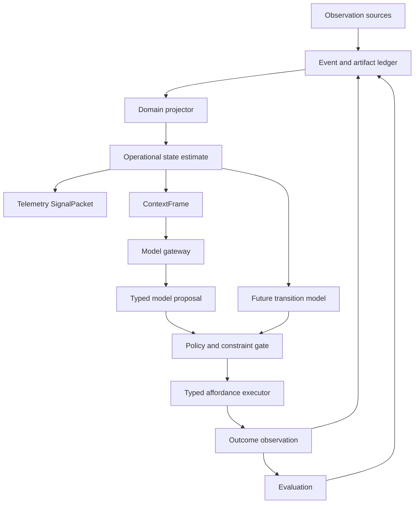

# Runtime Architecture

## Architectural style

Blackcell is a modular monolith with Clean/Onion dependency direction, vertical feature slices,
and an event-driven kernel. These patterns apply at different scales: dependency direction keeps
policy independent from frameworks, slices keep behavior cohesive, and events make accepted state
transitions durable and replayable. The initial runtime uses in-process dispatch and SQLite; it
does not simulate maturity by requiring a distributed broker.

The model gateway, persistence, retrieval, solvers, execution, telemetry, and HTTP server are edge
adapters. Workflows coordinate feature ports. Only bootstrap code assembles concrete dependencies.
For runtime-v1, SQLite schema, WAL, transaction, filesystem, append, integrity, and recovery
behavior form the supported trusted local kernel; describing persistence as an edge does not promise
an interchangeable storage backend.

`blackcell.bootstrap.repository.compose_repository_runtime` is the repository runtime composition
entry point. It constructs the kernel stores, journals, gateway, repository adapters, workflow,
and replay handler, then injects them into the application facade. `RepositoryOperator` exposes
product use cases rather than store attributes; HTTP and worker bootstrap receive their event and
artifact capabilities explicitly from `RepositoryRuntimeComponents`.

Architecture consolidation follows ADR 0008. A class, Protocol, package, DTO family, adapter seam,
or application service is retained when direct evidence establishes independent authority,
failure, persistence, deployment, substitution, product-use-case, ownership, or security
semantics. Binary dependency, composition, compatibility, and replay rules may fail CI; record
similarity, Protocol breadth, module size, import breadth, constructor fan-in, and package co-change
remain advisory and have no pass threshold.

Current contract ownership is explicit:

| Concept | Canonical owner | Boundary |
| --- | --- | --- |
| Live model admission and routing | `blackcell.gateway` | Pre-invocation policy and prepared calls |
| Durable decision requests and attempts | `blackcell.features.request_decision` | Fenced, persisted model-call evidence |
| Authorization, execution, and observation | `blackcell.control` | Authority-bearing action records |
| Evidence selection | `blackcell.features.retrieve_evidence` | Content-addressed selection and omission semantics |
| ContextFrame construction | `blackcell.features.build_context` | Persisted model-context bytes and identity |
| Benchmark decision models | `blackcell.models` | Evaluation and CLI benchmark compatibility, not the live gateway |
| Telemetry attribute values | `blackcell.telemetry` | Telemetry-local JSON-shaped values |
| Historical context baselines | `blackcell.context` | Compatibility-only; current runtime paths may not import it |

`build_context` consumes the concrete feature-owned `EvidenceSelection`; the former broad
field-copying `EvidenceSelectionLike` family is not a substitution boundary. The deterministic and
FTS5 objective matchers remain independently selectable behind the retrieval strategy port.

## Boundaries

Blackcell keeps one immutable evidence ledger and multiple domain-scoped projectors. A
repository, personal work queue, and telemetry system do not share one universal state
schema, transition model, action space, horizon, or objective. ContextFrames may compose
state estimates across domains, but prediction and control remain bounded by domain.



Durable multi-agent orchestration is a consumer of these same boundaries, not a separate agent
runtime. DAG nodes invoke typed workflow or feature ports; their attempts, leases, results, and
evaluations append to the same ledger and share the same authorization path.

Local scheduler state and its corresponding kernel event share one explicit SQLite transaction.
`SQLiteKernelSession` owns the transaction boundary, permits bounded adapter data statements, and
uses `EventStore.append_many_in_transaction` without nested commits. The event store verifies the
active connection, database identity, and foreign-key enforcement; either all adapter rows and
events commit or all roll back. External effects and file-backed artifact bytes remain outside
that atomic unit and still require preparation, idempotency, and reconciliation.

Runtime DAG definitions are immutable and content-addressed. Every node declares a handler port,
principal and role, typed input bindings and output schema, dependency set, retry policy, timeout,
token/latency/cost budget, side-effect class, required reviewer/verifier approvals, gateway
capability, classification, locality, and determinism requirement. Validation establishes a stable
topological order and rejects missing edges, cycles, schema drift, self-approval, irreversible
scheduler authority, and role-policy violations before any work can be submitted.

Planner, executor, reviewer, verifier, and synthesizer profiles are separate gateway-policy
boundaries. Only executors may declare effects; verifiers are local and deterministic; reviewer or
verifier roles may approve bounded reversible work; synthesizers have no authority to override a
symbolic denial. These are runtime contracts under `blackcell.orchestration`, distinct from the
repository's Codex developer-tool agents.

Deterministic orchestration simulation exercises those contracts before persistence or dispatch.
Scenarios declare bounded attempt outcomes, usage, and independent approvals; reports preserve
attempt and fencing evidence, reject stale completions, count duplicate delivery as one commit,
enforce retry and node budgets, block descendants after terminal failure, and derive a stable
content identity. The simulator has no scheduler, worker, gateway, or ledger side effects.

The durable SQLite scheduler persists the canonical DAG, stable node state, independent approval
decisions, bounded leases, monotonically increasing fencing tokens, cumulative usage, and one
terminal outcome per attempt. Submission and terminal outcomes are content-idempotent. Ready-node
claims require successful dependencies and every declared approval; retry backoff and lease expiry
consume bounded attempts; stale or expired workers cannot commit. Terminal denial or failure
blocks descendants and fences other active branches. Every accepted transition and run-status
decision appends a content-free event in the same transaction, and inspection reconstructs and
revalidates the DAG after restart. Worker transport and handler dispatch remain outside the
persistence adapter.

## Service security boundary

Service composition requires one explicit absolute data root; the root, artifacts, and reserved
backup directory are owner-only, non-symlink paths, and an existing database is an owner-only
regular file. There is no repository or current-directory service fallback. Exactly one opaque API
credential comes from the environment or an owner-only non-symlink file, never tracked config or
argv. Secret display is redacted and candidate verification is constant-time.

Inbound authentication preserves header multiplicity and accepts exactly one strict Bearer value.
It yields a typed principal whose `read`, `run`, `approve`, and `admin` scopes are checked as an
explicit subset for each protected operation; admin is not ambient authority. Binding defaults to
loopback, authentication remains mandatory on every bind address, and forwarded-client trust is
disabled. Telemetry redacts sensitive keys, credential shapes, and configured secret values before
records enter memory or exporters. TLS termination remains a deployment boundary. A single
process-local sliding request window covers every protected route before authentication; public
health routes are exempt. The service does not trust proxy-derived client identity, so this limit
is deliberately global rather than per-client.

## HTTP service edge

The versioned `/api/v1` Litestar adapter accepts strict immutable msgspec contracts and delegates
through one injected `RuntimeApiPort`. Its concrete bootstrap adapter reuses the canonical
Repository Operator, observation ingestion, historical replay, evaluation, event ledger, and
durable scheduler inspection/approval use cases. HTTP handlers do not append kernel or scheduler
rows directly, and transport types do not enter features, workflows, gateway, orchestration, or
kernel packages.

Only `/health/live` and `/health/ready` are public. Every API route reads raw ASGI header tuples,
requires exactly one Bearer value, and checks an explicit `read`, `run`, or `approve` scope before
decoding a body or invoking a use case. Unknown fields, schema drift, oversized bodies and
collections, unsafe stream namespaces, malformed query bounds, and duplicate credentials fail
closed. Error responses contain one stable code and no request, credential, path, or exception
content. OpenAPI, sessions, cookies, browser auth, CORS, and proxy-derived identity are not enabled.

Service composition creates the canonical SQLite path as an owner-owned mode-`0600` regular file
before any adapter connects. Run submission is synchronous in this first local contract.

`blackcell-runtime api` serves the application through Granian's ASGI interface with one worker,
one runtime thread, HTTP/1, disabled WebSockets and access logging, bounded connection backlog and
request backpressure, and a bounded worker-kill timeout. Granian owns API signal handling.
`blackcell-runtime worker` installs SIGINT/SIGTERM handling before worker construction, recovers
expired scheduler leases, acquires one fenced node at a time, and stops before acquiring new work.
The worker loads only the five reviewed Repository Operator handlers; it validates dependency and
result artifacts, accounts node usage before completion, and lets the scheduler reject stale
leases. Execution reuses the canonical operator, while verification uses historical replay only.

The rootless Podman edge builds one production image for both modes. A numeric non-root user,
read-only root filesystem, bounded temporary filesystem, dropped capabilities, and
`no-new-privileges` constrain each service without mounting engine or provider authority. Compose
publishes the container's explicit `0.0.0.0` bind only through host loopback, mounts the observed
repository read-only with optional Git locks disabled, and serializes worker startup behind API
readiness. Both services share one named volume above the canonical owner-only data child, so
container replacement preserves SQLite and artifacts without weakening runtime path validation.

Mutation admission measures the active SQLite database, WAL/SHM, and artifact tree while excluding
backups, reserves explicit headroom, makes readiness fail closed, rejects API mutations, and keeps
the worker from acquiring new work when exhausted. Artifact metadata transactions serialize an
exact aggregate artifact-byte ceiling across API and worker stores. These are application-level
admission controls, not filesystem or distributed hard quotas.

The recovery adapter uses SQLite online backup to capture one consistent database snapshot, then
copies and hashes the exact immutable artifact inventory visible in that snapshot. A canonical
manifest records database identity, schema and event high-water position plus every artifact path,
size, and digest. Owner-only files and directories are fsynced and the manifest is written last
before the bundle directory is renamed into place. Verification rejects unsafe entries, inventory
drift, hash drift, and SQLite integrity or foreign-key failures. Count retention prunes only oldest
verified bundles after a successful backup and never prunes canonical events or artifacts.

Restore always verifies first and creates an absent data root through a staged same-filesystem
rename; it never replaces the active root or cuts processes over automatically. Operators copy a
verified bundle off-volume, stop writers, restore to an absent target, select it explicitly through
`BLACKCELL_DATA_DIR`, and prove readiness plus live-free replay. This establishes tested local
disaster recovery without claiming offsite transport, encryption, filesystem hard quotas, or
power-loss behavior on untested storage.

## Runtime benchmark boundary

RuntimeBench composes the existing API, worker, scheduler restart/fencing, quota, recovery, and
rootless-container acceptance tests without introducing another runtime path. Each direct probe
runs in a secret-minimized environment and retains exact argv, declared overrides, pass/skip
counts, call and subprocess timings, output digests, and a source/environment fingerprint. Raw
probe logs are captured only in memory and are not written into the report.

The rootless acceptance test explicitly drives the image-declared Podman healthchecks while
polling. This preserves health validation on hosts, including the recorded WSL2 environment,
where the rootless engine cannot install user-systemd health timers. Compose still declares the
worker's healthy-API dependency; the test starts the worker with `--no-deps` only after it has
independently established API health.

The retained WP25 artifact is a reproducible single-host reliability baseline before optimization.
Its pytest and process timings are not service SLOs, sustained throughput, production RTO/RPO, or
evidence for changing runtime defaults.

## Command, event, projection, and artifact separation

Commands request work and use imperative names. Events record accepted facts in past tense.
Projections are rebuildable views. Artifacts are immutable, content-addressed payloads.

| Category | Examples |
| --- | --- |
| Command | `IngestObservation`, `BuildContext`, `RequestDecision`, `ExecuteAction` |
| Event | `ObservationRecorded`, `PolicyEvaluated`, `ActionSucceeded`, `OutcomeObserved` |
| Projection | `OperationalStateEstimate`, `SignalPacket`, `RunTrace` |
| Artifact | ContextFrame, state snapshot, model request/attempt/response/failure, tool result, outcome-observer result, evaluation, transition |
| Definition | `AffordanceDefinition`, `ConstraintDefinition`, `EvaluationSpec` |
| Runtime instance | `ActionProposal`, `PolicyDecision`, `ActionAttempt`, `EvaluationResult` |

## Event envelope

Every event occurrence has a unique event ID and a stream-local sequence. The envelope also
contains event and schema versions, recorded and effective times, source and actor,
correlation and causation IDs, payload hash, and an optional idempotency key.

An idempotency key identifies a retried command, not an event's identity. Repeated equivalent
observations are still separate occurrences unless they are proven retries of the same
ingestion request.

Appending uses optimistic expected-sequence checks. Projectors record their version and last
processed global sequence. Projection tables are disposable and rebuildable.

## Artifacts

Large or sensitive ContextFrames, prompts, responses, tool output, and reports are stored as
content-addressed artifacts. Events contain hashes and metadata rather than duplicating
content. Artifact reads verify the digest before returning bytes.

The target ContextFrame codec serializes the exact identity payload, so its kernel artifact digest
is also its `frame_id`. A rebuildable SQLite index stores discovery metadata only; it never stores a
second JSON payload. `DailyOperatorV2Workflow` persists and verifies this artifact before model
reasoning. The bounded durable-run protocol links that exact artifact, proposal, proof bundle,
authorization, execution result, and causal trace into one create-only run stream. Proposal, proof,
and authorization artifacts use explicit feature-owned codecs; the execution journal remains the
single owner of execution-result bytes.

Artifact bytes and metadata commit before the event that references them. The file-backed artifact
store and event append do not share one transaction, so a process interruption may leave an inert
orphan artifact. It must never create an event whose artifact was not committed and verified.

## Durable run and execution protocol

One `DailyOperatorV2Request.run_id` owns one `daily-operator-run:{run_id}` stream and one canonical
request digest. A terminal duplicate, an interrupted duplicate, and changed input under the same
run ID all fail before ingestion, reasoning, or execution. Run events share the run correlation ID
and form one immediate-predecessor causation chain. Observation events are caused by `run.started`;
the ContextFrame carries their additional provenance dependency.

The execution journal commits a content-addressed preparation and a `PREPARED` claim before an
adapter call. The preparation binds the run, invocation, authorization, action, affordance
definition, adapter ID, and adapter contract version. Terminal retries return the stored result;
`UNKNOWN` retries reconcile. A stranded preparation is fenced only through an explicit manual
recovery authorization that attests the original worker stopped, and recovery reconstructs the
exact preparation from the artifact rather than caller memory.

This is process-crash recovery, not distributed exactly-once execution. Automatic leases,
gateway-call recovery, power-loss guarantees, and whole-workflow resume remain separate gates.

## Replay modes

Historical replay reads recorded events, model results, tool results, and artifacts. The
Phase 1 Repository Operator verifies every referenced artifact and independently rebuilds
the recorded operational-state projections to reproduce their content hashes. It never
calls an observer, live model, or executor and never repeats a side effect. Policy and grader
re-execution belongs to a later versioned replay contract; their recorded artifacts are
integrity-checked now.

Counterfactual rerun applies a current model, projector, policy, or grader to a historical
ContextFrame. It creates a new experiment and correlation ID. It is not deterministic replay.

## Action protocol

The immutable `daily-operator/v1` grammar remains readable for historical replay only:

```text
run.started
  -> run.context-recorded
  -> run.proposal-recorded
  -> run.constraints-evaluated
  -> run.authorization-decided(allow | deny | require-approval)
  -> run.execution-recorded?  # allowed actions only
  -> run.trace-recorded
  -> run.completed | run.failed
```

SQLite and an external side effect cannot share one atomic transaction. The prepared-action
journal prevents blind re-execution and preserves uncertainty for reconciliation; it does not make
the external effect atomic.

Runtime-v1 adds a separate `daily-operator/v2` grammar defined by ADR 0006. It records the
developer-owned EvaluationSpec and initial state before context, inserts real model
request/attempt/response evidence before the proposal, and records `run.outcome-observed`, the
outcome-state snapshot, evaluation, and optional observed transition after authorization/execution.
Version-one history is never reinterpreted. Version-two writing is now active through the public
Repository Operator facade after composer, replay verifier, and compatibility characterization
landed together. WP26 removed the version-one public writer and predecessor coordinator while
retaining its strict decoder, artifact verification, and projection findings behind the live-free
replay port.

WP26 also removed the prototype world, NeSy, harness, latent, generic-ledger, generated-agent, and
adapter-discovery surfaces. The kernel database and its owned journals/projections are now the only
runtime write authority; historical v1 decoding is not a second store or execution path.

## Model boundary

The capability gateway receives one serialized ContextFrame and response schema and returns a
typed proposal. Models have no direct tool access or ambient authority. Blackcell owns policy,
approval, execution, and outcome recording.

The public Repository Operator defaults to a deterministic local recorded adapter derived from
the admitted request. Its optional Codex CLI adapter is remote and nondeterministic by policy,
requires an explicit model ID, and prepares a temporary Git workspace containing only canonical
input and schema documents. Its process sandbox is provided by Codex CLI, not by Blackcell.

## Prediction boundary

`features.predict_transition` provides the first runtime-v1 advisory baseline over canonical
`OperationalBeliefState` snapshots. It persists an explicitly requested current fact through one
declared action with conservative confidence, source claim/event provenance, a bounded horizon,
and explicit assumptions. Missing, expired, ambiguous, or conflicted source evidence produces an
unknown prediction instead of an invented value.

Scoring requires a later state from the same domain and source stream. It distinguishes exact
matches, mismatches, missing outcomes, conflicting outcomes, and unscored unknown predictions,
using canonical JSON scalar identity so booleans and integers do not collapse. Predictions and
scores are content-addressed DTOs only: they append no observations, commit no transitions, and
grant no execution authority.

WP11 deliberately adds no local-model adapter. The repository has neither an installed offline
predictor runtime nor a configured prediction route or matched WP10 evaluation. Promotion requires
a pinned deployment, gateway-owned resource bounds, and a like-for-like outcome-scoring comparison;
the machine-readable deferral is recorded in `docs/decisions/runtime-v1/wp11-local-predictor.json`.

WP24 retains a matched eight-scenario PredictionBench report over state persistence and an
experiment-only developer-declared-effect baseline. Both use the same source/action/target/horizon,
canonical outcome, and scorer; the declared-effect fixture contains an explicit failed expectation
so it is not an outcome oracle. The local-neural and hybrid-neural-symbolic candidates remain
unavailable with null measures. Their deferral, and the prohibition on learned-world-model or
neuro-symbolic-system claims, is recorded in
`docs/decisions/runtime-v1/wp24-prediction-experiments.json`.

## Constraint solver boundary

Deterministic Python policy remains the default and reference `ConstraintSolver`. The optional
Clingo 5.8 adapter receives only the already-selected current values for decisive predicates and
independently checks `EXISTS`, `EQUALS`, `NOT_EQUALS`, `IN`, and `NOT_IN`. It returns the reference
evaluation byte-for-byte at the DTO level when parity holds and fails closed with a content-free
integrity error on disagreement or solver failure.

Freshness, confidence, future-effective evidence, conflicts, unknowns, provenance, explanations,
proof identity, and authorization remain Blackcell-owned. `DailyOperatorV2Workflow` accepts an
explicit solver port but defaults to `DeterministicConstraintSolver`; the Repository Operator does
not opt into Clingo. Compatibility and bounded promotion evidence are recorded in
`docs/decisions/runtime-v1/wp12-clingo.json`.

## Observability boundary

Domain evidence and diagnostic telemetry remain separate. Stable internal spans include:

- `blackcell.observe`;
- `blackcell.state.project`;
- `blackcell.context.build`;
- `blackcell.model.decide`;
- `blackcell.policy.evaluate`;
- `blackcell.affordance.execute`;
- `blackcell.outcome.observe`;
- `blackcell.evaluation.grade`;
- `blackcell.transition.commit`.

Span attributes contain low-cardinality identifiers and versions. Prompt and evidence content
is artifact data governed by an explicit redaction policy. The application workflow depends on a
telemetry port whose default is a no-op. The OpenTelemetry edge adapter maps already-sanitized
records to deterministic transport trace and span identifiers, then exports them through a bounded
asynchronous OTLP/HTTP batch. Export is disabled unless the runtime receives an explicit endpoint;
API and worker lifecycle shutdown flushes and closes the adapter without making telemetry failure a
domain failure. The adapter does not install a global tracer provider, write domain evidence, or
define the domain schema.
