# Runtime Architecture

## Architectural style

Blackcell is a modular monolith with Clean/Onion dependency direction, vertical feature slices,
and an event-driven kernel. These patterns apply at different scales: dependency direction keeps
policy independent from frameworks, slices keep behavior cohesive, and events make accepted state
transitions durable and replayable. The initial runtime uses in-process dispatch and SQLite; it
does not simulate maturity by requiring a distributed broker.

ADR 0009 establishes the alpha boundary. One foreground daemon owns project state, scheduling,
policy, providers, recovery, and ordered events behind `/api/alpha/v1`. The JSON-first CLI,
PyRatatui TUI, and Litestar web UI are clients of that service and never embed another scheduler or read
mutable persistence directly. An operating-system service manager may supervise the process;
BlackCell does not implement double-fork or PID-file daemonization.

`blackcell-runtime daemon` is the foreground composition root. Without alpha configuration it
starts only the authenticated API, so accepted work remains durably queued. Explicit execution,
review, and verification configuration files independently enable `alpha-worker`,
`alpha-review-worker`, and `alpha-verify-worker`; the daemon validates every configured boundary
before spawning any child. It never auto-starts the historical `worker` command. All children
receive the same validated repository and data roots; a component exit stops its siblings with
bounded graceful and forced cleanup. On Linux, the optional `blackcell.service` user unit supervises
that foreground process with systemd control-group termination and journal output. Installation
references an existing owner-only environment file, is idempotent for byte-identical unit content,
and never writes credentials or starts the service implicitly. Other platforms retain foreground
API mode; configured alpha acceptance fails closed where the Bubblewrap contract is unavailable.

Kernform integration is an argv-only subprocess adapter pinned initially to version `0.1.0` and
`kernform.command/v1`. BlackCell validates bounded agent-mode JSON, then separately closes the
command-specific `check` and `init` result payloads. Check results must carry the exact conformance
set, bounded deterministic requirements, catalog identity, mode, and file count. Init results must
carry a bounded operation count and exact plan, state, and evidence identities whose canonical paths
match the two accepted in-root artifacts. Unknown result fields, semantic status mismatches, duplicate
requirements, or path drift fail closed. A disposable interoperability probe against the current
Kernform 0.1.0 Python/Rust checkout initialized an API/web project and checked all 39 managed files
as conformant through this adapter. BlackCell does not import Kernform's Python/Rust internals. The
accepted Python modular monolith remains the implementation baseline; no BlackCell Rust or PyO3
rewrite is authorized.

Runtime-v1 event, artifact, policy, persistence, scheduler, recovery, and replay contracts are
candidate foundations. `DailyOperatorV2Workflow` and `/api/v1/runs` are legacy migration evidence,
not alpha execution. The current local process runner is also not a sandboxed worktree executor.

The A03 core adds closed contracts under `/api/alpha/v1` for project registration, accepted intent,
accepted plans, asynchronous run submission, run status, ordered events, and replay. Project,
intent, plan, and initial run records are immutable one-event streams in the existing event ledger.
Every accepted plan has a validated acyclic dependency graph, explicit node budgets and declared
effects, an exact Git base commit, per-node repository path authority, and at least one direct-argv
acceptance check per node. Every check node declares both repository-read and process effects.
Repository-write nodes additionally declare nonempty path and changed-file authority, and all such
nodes must form one dependency-ordered chain; alpha rejects divergent writers until an explicit
merge contract exists. A submitted run records `alpha.run.queued` and returns HTTP 202; it does not
dispatch itself through the legacy worker.

Alpha clients resume events from the kernel ledger's monotonic global position. A bounded page may
advance past legacy positions but returns only `alpha.*` payloads, so reconnect cannot stall or leak
the legacy API surface. Replay resolves and digest-checks the exact project, intent, and plan events
referenced by the queued run and reconstructs state without a provider, worker claim, or effect.

`RuntimeHttpClient` is the shared typed Python client boundary for the CLI and terminal projection. It
owns strict request encoding, response decoding, endpoint policy, bounded failures, and authenticated
transport for project registration, intent and plan acceptance, run submission, status, cancellation,
replay, and ordered event pages. Clients provide the API token only through `BLACKCELL_API_TOKEN` or
the existing owner-only file named by `BLACKCELL_API_TOKEN_FILE`; credentials are never accepted as
CLI arguments or represented in output. Incoming request contracts remain capped at 1 MiB. Client
response reads and typed decoding instead share a closed 256 MiB ceiling, which covers the maximum
200-event service page with request-sized payloads plus envelopes without accepting unbounded remote
content. The JSON-first `blackcell alpha` commands load mutation
inputs from bounded, regular, closed-contract JSON files and delegate all reads and writes to that
client. They do not open runtime storage, schedule work, or invoke `/api/v1/runs`. Cross-language
projections use the same closed alpha wire contracts and must validate their own response bindings;
they do not duplicate Python implementation authority.

The terminal projection places a framework-neutral `AlphaTuiController` between that synchronous
client and PyRatatui. Every client call crosses an `asyncio.to_thread` boundary;
only the caller event loop replaces the immutable projection snapshot. Event refreshes are
serialized, resume from the last global cursor, validate page and binding monotonicity before state
changes, and retain only a bounded recent window. Command responses are checked against their
request or selected run identity, and a changed run invalidates any older replay view. The
controller contains no credential, scheduler, daemon-persistence, provider, worktree, or
legacy-runtime port. PyRatatui 0.2 is a bounded direct runtime dependency whose native extension is
resolved from an ABI3 wheel on the measured Python 3.14 Linux x86_64 host.

The public `blackcell alpha tui` command composes that edge from the same authenticated
`RuntimeHttpClient`, an owner-only cursor store, and `AlphaTuiController`. `AlphaTuiApp` accepts only
an injected controller factory and has no credential widget. A separate workflow task reads one
canonical absolute, no-follow regular JSON file of at most 1 MiB outside the UI loop, clears its path
immediately, decodes the selected closed project, intent, plan, or run contract, and invokes only the
matching controller method. Missing, symlinked, empty, oversized, changed, malformed, and
operation-mismatched files fail with one content-free local code. Complete request-to-response fields,
cross-record replay identities, and plan topology are checked before projection state changes.

The shell renders connection state, bounded ordered events, project and intent summaries, the accepted
plan DAG, run status and cancellation, replay artifact metadata, integrity findings, verification
lifecycle, verdict and evidence status, and only the retained-checkout or reconciliation state present
in current daemon contracts. Artifact rows and findings are capped, markup is disabled, and artifact
bytes and exception content never enter widgets. `alpha-replay/v2` does not expose admitted independent
review findings, verification matrix rows, or recovery commands; the shell labels that gap and neither
invents those views nor acquires recovery authority. PyRatatui's native terminal draw and event poll
remain on the main asyncio thread. Connection, event, and shared workflow/run lanes use duplicate-start
suppression around bounded asyncio tasks; the controller then serializes and offloads synchronous HTTP
work. The default one-second event refresh skips a tick while an earlier page is pending. Headless
coverage verifies keyboard-operable controls, responsive input during a blocked refresh, serialized
calls, content-free failures, real Ratatui widget construction, and terminal restoration through an
injected async-terminal boundary.

Optional TUI cursor persistence is a disposable client projection cache, not runtime state. Each
closed canonical checkpoint stores only a SHA-256 endpoint identity, a monotonic global cursor, and
the most recent visible alpha event's cursor, ID, and payload digest. The file adapter uses a
dedicated owner-only directory, no-follow bounded reads, `0600` files, and fsynced atomic replacement.
On connect, the controller proves that the stored ledger position still exists and re-reads the
witness through the authenticated shared client before adopting it; a reset or mismatch leaves the
projection untouched. After refresh, it persists the witnessed checkpoint before publishing the new
in-memory cursor. A storage failure can therefore replay already-seen events, but cannot skip unseen
events or grant the client daemon authority.

The browser event channel never places the long-lived bearer token in a WebSocket URL. A guarded
read-scope HTTP request issues a short-lived, single-use opaque ticket; the daemon retains only its
digest, bounded principal metadata, and expiry. The socket consumes that ticket before accept,
validates the resume cursor, and emits the same strict `AlphaEventPageResponse` bytes as the HTTP
event API. Each connection pages the durable ledger directly through `AlphaRuntimeApiPort`, awaits
every send for backpressure, keeps one pending disconnect receive, and accepts no client messages.
A process-local connection cap bounds polling load, while invalid, expired, replayed, or excess
connections receive stable close codes. This is deliberately not a second broker or event history:
reconnect resumes from the daemon cursor. Granian remains one worker with bounded backpressure and
access logging disabled, but enables ASGI WebSocket handling for this route.

`/alpha` is a public, data-free browser shell backed only by bounded packaged same-origin HTML, CSS,
and JavaScript. Every asset response is `no-store`, denies framing and cross-origin resources, and
uses a closed content security policy with no inline code, external assets, cookies, sessions, CORS,
or browser-side persistence. The dependency-free client refuses bearer transport over remote
plaintext HTTP, clears the password input immediately, and retains the credential and event cursor
only inside the live page. Every initial connection and reconnect obtains a fresh one-use WebSocket
ticket. The client validates exact ticket, event, run, and replay bindings and byte bounds before
advancing the cursor or displaying results, retains at most 200 recent events, and updates the DOM
only with text nodes. Its accessible views expose run status, replay, cancellation, and ordered live
events. A separate accessible intake reads one local project, intent, plan, or run JSON file into a
bounded transient buffer, clears the file control immediately, and never retains file content, file
paths, or request objects in global state. Before transport, the client validates closed keys,
versions, identifiers, digests, collections, plan-node budgets and effects, repository paths,
acceptance commands, DAG topology, and writer ordering. The daemon still performs authoritative
cross-record, idempotency, Git-base, and policy admission. Accepted responses must bind back to the
submitted identities and content before plain-text display; only a bound run response populates the
run inspector. Disconnect, replacement connection, page exit, abort, or protocol failure clears the
credential, file selection, workflow projection, event projection, and command output. This
presentation cache is not daemon state and a page reload resumes from cursor zero.

The first A04 foundation is a Git worktree lifecycle. An immutable specification
binds the repository, base commit, allowed path prefixes, changed-file budget, worker, attempt, and
fencing token to one digest-derived local branch and checkout beneath an owner-only isolation root.
Git runs as bounded direct argv with global and system configuration disabled, hooks disabled, and
configured external checkout filters refused. Inspection compares the final tree to the approved
base with rename detection disabled and adds every untracked file, including ignored files, so a
commit cannot hide a path-budget violation. Failed or cancelled work is retained when a checkout
exists. The adapter exposes a separate successful-cleanup operation that requires a clean,
policy-compliant checkout and removes only the checkout; its local branch and commits remain as
recovery evidence. The alpha runtime calls that operation only after durable cleanup intent and
records the exact removal or failure afterward.

The proposal boundary sends a model only a bounded, content-addressed set of UTF-8 files plus the
objective, constraints, approved base, allowed paths, and path budget. It sends no repository or
worktree path and grants no tools. The gateway call uses CODE capability, an explicit locality and
classification policy, bounded token, latency, and cost budgets, and a closed output schema. Its
result is an inert create, replace, or delete proposal bound to the exact evidence digest; the
provider never receives the mutable checkout.

BlackCell alone applies that proposal. The initial text executor admits only regular UTF-8 files in
existing directories, rejects Git metadata, traversal, symlinks, stale before-content digests, and
out-of-policy paths, and preflights the entire proposal before its first effect. Per-file changes are
atomic, caught partial failures are rolled back when possible, and the final base-relative worktree
delta must exactly match the admitted paths. A worktree with an uncertain outcome is retained.

Neither the worktree nor this in-process text executor is an operating-system sandbox. The initial
Linux acceptance backend therefore launches direct argv through Bubblewrap and fails closed when
Bubblewrap or one of its required features is unavailable. A dedicated JSON status descriptor must
prove that the child started and that its mount, PID, IPC, UTS, cgroup, and network namespaces differ
from the daemon's namespaces; a setup failure cannot masquerade as an expected nonzero check result.

The sandbox starts from an empty mount namespace. It exposes fixed system roots and only explicitly
authorized runtime roots read-only, mounts the execution worktree read-only at `/workspace`, masks
its `.git` link, creates a bounded private `/tmp`, and omits host `/etc`, home, run, variable-data,
and mount trees. The environment is cleared and rebuilt from fixed values. Plan argv names a
host-policy alias that is rebound to an exact canonical executable; no shell or plan-controlled PATH
lookup occurs. Descendants can still invoke binaries visible inside an authorized system or runtime
root, so those roots remain trusted host configuration rather than provider authority.

Bubblewrap unshares user, mount, PID, IPC, UTS, cgroup, and network namespaces, disables nested user
namespaces, drops all capabilities, creates a new session, and kills the namespaced child when its
parent dies. `prlimit` bounds address space, CPU, process count, open files, output file size, and
core dumps; BlackCell separately bounds wall time, stdout, stderr, and the private temporary
filesystem. Cancellation terminates the wrapper process group and Bubblewrap tears down the
namespaced descendants. Exact Git inspections before and after every command must match, including
all untracked files. Stream bytes remain bounded and hidden behind exact lengths and digests.

This is concrete namespace, mount, network, capability, and resource containment, not a universal
hostile-code claim. The alpha backend does not yet install a seccomp filter or manage cgroup-v2
controllers, and explicitly mounted runtime trees can be changed by separately authorized host
processes.

The alpha run stream now owns the durable execution lifecycle. A node claim binds its attempt,
monotonic fencing token, worker, expiry, and complete worktree specification before Git creates the
checkout; a second event records the exact clean inspection before provider or file work is
eligible. For a repository writer, a third strict event records the deterministic provider request
ID and matching canonical context and artifact digests before the provider process is invoked.
Completion, failure, and cancellation acknowledgement require that exact active fence.
`POST /api/alpha/v1/runs/{run_id}/cancel` immediately closes queued work and requests cooperative
stop for an active attempt. Canceled and failed worktrees are retained.

The host Git adapter commits admitted changes with a fixed BlackCell identity, disabled hooks and
signing, ignored global and system configuration, and direct bounded argv. Node success is accepted
only from a clean policy-compliant checkout and durably binds the result digest, exact final
inspection, and final Git head. Successful checkouts remain truthfully marked retained until the
ordered stream records `alpha.node.worktree-cleanup-requested`, Git proves a clean compliant removal
with the expected head, and `alpha.node.worktree-cleaned` binds the removal evidence. The local
deterministic branch and commit survive checkout removal. A failed cleanup records a stable code and
the checkout's observed retention state without changing a successful run into a failed run or
retrying the effect blindly. A later node derives its checkout base from the latest successful
repository writer in its dependency ancestry, or from the accepted plan base when it has none. The
static single-writer-chain rule makes that derivation unambiguous and replay revalidates every claim
against the heads already recorded in the stream.

Startup reconciliation is an explicit operation for the exclusively owned daemon startup path; API
construction never runs it implicitly. It invalidates every surviving lease. Before provider
dispatch, a missing or exact unchanged checkout is safe to requeue because no external proposal
request has crossed the durable boundary. After `alpha.node.provider-dispatch-started`, missing,
unchanged, and changed checkouts all move to `reconciliation-required` with
`alpha-provider-dispatch-ambiguous`; BlackCell cannot prove whether the external provider accepted
or completed the call and therefore never invokes it again automatically. Existing checkouts are
retained, while a missing checkout is reported as not retained. A changed or otherwise
uninspectable pre-dispatch checkout also requires reconciliation. Queued-run discovery preserves
the event ledger's global order. Cancellation already recorded before startup keeps precedence and
closes through the existing cancellation path.

The A04 bootstrap worker joins these boundaries without granting authority back to the provider. It
selects the first dependency-ready node in durable run order, then claims and prepares exactly that
node. Before a repository writer invokes the provider, the host reads at most 64 admitted regular
UTF-8 files, 256 KiB per file and 1 MiB in total. Git metadata components, symlinks, special files,
binary content, and unstable reads fail closed. The provider receives only the resulting immutable
context; the host applies its proposal, creates a fixed-identity commit, and passes direct declared
argv to the injected acceptance backend. Check-only nodes bypass both provider and text-effect
ports and inherit the latest successful writer head from their dependency ancestry.

Context, proposal, provider metadata, applied-effect results, exact acceptance commands, raw bounded
stdout and stderr, typed check results, and one terminal node manifest are stored by content digest.
The unreleased `alpha-node-outcome/v2` manifest closes each command-to-result-to-stream chain instead
of trusting a command digest with no source artifact. Artifact bytes commit before a lifecycle event
may reference them. In particular, the canonical context artifact commits before the
provider-dispatch marker, and the resulting event ID is the provider call's causation ID. A process
crash may leave an unreferenced content-addressed blob but cannot create a claimed missing artifact.
Success, failure, and cooperative cancellation bind the terminal manifest digest when storage
succeeded; cancellation also captures completed partial stages and wins a race observed immediately
before success. Stable failure events contain only typed codes and artifact identities, while failed
and canceled checkouts remain available for recovery.

`alpha-replay/v2` first re-folds the immutable event grammar and worktree evidence, then verifies the
terminal artifact graph through the same database-backed artifact store used by the API and worker.
It bounds every artifact and the aggregate read, requires canonical closed JSON and exact stored
metadata, and binds outcomes to the run, node, attempt, fence, lease, worktree specification, source
context, proposal, provider result, effect, declared check command, result, and stream bytes. Replay
does not receive provider, executor, acceptance-runner, or worktree-effect ports. Missing or changed
artifacts and semantic binding mismatches are explicit failures; unavailable storage, read budgets,
and terminal failures without an outcome reference are inconclusive; runs with no outcome evidence
yet are not applicable. The response exposes only evidence metadata, stable findings, and a
deterministic evidence digest, never artifact content.

Independent review starts from a separate bounded `alpha-review-context/v1` contract owned by the
host. Its immutable acceptance snapshot binds the run objective and constraints, dependency graph,
effect and path authority, exact check argv and expected exit codes, command and result identities,
and the replay evidence digest. Source, effect, command, result, stream, and outcome excerpts receive
content-derived evidence IDs and line bounds before a REVIEW-capability gateway call. The reviewer
has no tools and its closed `alpha-review-proposal/v1` output contains only a context digest, cited
proposed findings from the fixed correctness and reward-hacking taxonomy, and a summary. It cannot
emit approval, change acceptance, or self-admit. A deterministic host function separately checks
the context identity and every citation before producing `alpha-admitted-review/v1`; admission means
only that the proposal is structurally source-bound, never that its claims are true or verified.

Review durability is likewise separate from executor authority. A stream at `alpha:review:{run_id}`
starts only from the exact ledger-backed `alpha.run.succeeded` occurrence and binds that execution
event, the run-state digest, and the live-free artifact-evidence digest into an expiring reviewer
lease with monotonic attempt and fencing token. The provider request ID and already-stored acceptance
and context artifacts commit before REVIEW dispatch. The reviewer worker alone may complete or fail
its active fence; a distinct supervisor may requeue a pre-dispatch claim under a new fence. Once the
dispatch marker exists, restart records `alpha-review-dispatch-ambiguous` and requires reconciliation
instead of invoking the provider again. Successful review records only proposal, provider-result,
and structurally admitted artifact identities plus a finding count. Execution success therefore
remains distinct from an eventual review and verification verdict.

Review preparation has no live provider or effect port. It reuses the artifact replay verifier and
continues only for a fully verified successful execution graph. From those already-checked objects,
the host reconstructs the accepted project, intent, plan, DAG, effects, path limits, exact check
commands and expected exits, command and result identities, pass state, and accepted base revision.
It emits source-before, source-after, effect, outcome, command, result, stdout, and stderr evidence
with content-derived IDs and exact node, path or check, and line identities. Empty streams remain
explicit empty evidence. Replay verifies every complete artifact and retains its digest as evidence
identity. When content exceeds its allocated excerpt budget, the host emits a deterministic UTF-8
or base64 prefix with an explicit truncation marker; it never drops the evidence item or disguises a
partial excerpt as the complete artifact. The per-item allocation is the lesser of 32 KiB and the
512 KiB aggregate divided by the exact item count. More than 128 items still fails before execution
through plan admission and remains a closed review-context boundary.

The review-only worker has four capabilities: discover immutable successful-execution snapshots,
claim and finish the fenced review stream, write content-addressed artifacts, and call a REVIEW-only
provider. It has no executor, acceptance runner, worktree lifecycle, shell, or network-effect port.
It claims before preparation, revalidates the terminal execution event and state and evidence digests,
stores canonical review context before the dispatch marker, and uses that marker as provider
causation. Proposal, provider-result, and structurally admitted review artifacts all commit before
review success. Preparation, provider, admission, artifact, persistence, and stale-fence failures
remain content-free typed outcomes. A completed stream is not selected after process reconstruction;
a crash after dispatch remains ambiguous and is left to the separate supervisor reconciliation path.
Successful-worktree cleanup does not change the terminal execution snapshot used for review.

The foreground `alpha-review-worker` composes those four ports only when an owner-only mode-`0600`
`blackcell.alpha-review-config/v1` file outside the repository selects the REVIEW profile and model,
canonical Codex and Git executables, non-secret classification, explicit `remote-allowed` locality,
token, cost, and latency ceilings, environment-name allowlist, reviewer identity, distinct
supervisor identity, lease duration, and polling interval. If execution is also configured, the
reviewer, supervisor, and REVIEW profile cannot reuse execution authority. Provider boundaries are
validated before shared storage opens. Startup reconciliation runs as the supervisor; review work
runs as the reviewer through concrete read-only execution-source, reviewer-transition, and
write-only artifact facades, so the coordinator cannot call supervisor reconciliation or obtain the
full execution or artifact-store surfaces. The daemon may start this child independently of the
execution child, but never infers the configuration or starts historical V2. Storage headroom gates
new review work.

Verification is a deterministic host policy over the exact replay-built review context and the
structurally admitted review artifact; it does not call another model or acquire an effect port. Its
intent-to-evidence matrix binds objective, each constraint, every node, each write scope, every
exact check, and the unresolved-finding policy by criterion digest, evidence IDs, and finding IDs.
Every accepted node requires one outcome; writers require source-before, source-after, and effect
coverage; and each check requires the exact command and result artifact identities plus explicit
stdout and stderr evidence. A failed check or any unresolved admitted finding fails. Missing or
duplicate required evidence is inconclusive. Only complete host evidence plus a clear independent
review passes. This is an operational release gate, not a claim that arbitrary prose was formally
proved, and the report carries no source excerpts or reviewer prose.

Durable verification uses its own `alpha:verification:{run_id}` stream. Its candidate and lease bind
the exact successful execution and review events, replay state and artifact-evidence digests,
acceptance and context digests, proposal, provider-result, and admitted-review artifacts, and the
finding count. A verifier cannot reuse any actor identity already present in the execution success
or successful review history. Attempts and fencing tokens increase monotonically. A completed stage
records a `pass`, `fail`, or `inconclusive` verdict plus report and matrix digests; `verifier-error`
is a separate terminal event and never masquerades as a fail verdict. Because this stage performs no
external dispatch, startup may safely requeue an incomplete claim under a new fence, but the active
worker cannot reconcile itself.

The verification source discovers successful reviews in durable global event order without reading
artifact content before the verifier owns a fence. Preparation revalidates the exact candidate,
rebuilds the review context through live-free execution replay, and then checks canonical context,
proposal, provider-result, and admitted-review bytes against their content addresses, media types,
closed schemas, cross-artifact bindings, deterministic admission result, and finding count. Missing,
changed, noncanonical, or semantically unbound review evidence fails closed under stable source
codes; provider or reviewer prose never enters a durable failure event.

The verifier-only worker has four capabilities: immutable verification-source reads, fenced
verification transitions, content-addressed report writes, and the deterministic verifier. It has
no executor, reviewer, supervisor, acceptance runner, worktree, shell, or network-effect port. It
claims before preparation and commits one canonical report before the completed event binds its
verdict, report digest, and matrix digest. `pass`, `fail`, and `inconclusive` are all completed
outcomes and are not selected again after reconstruction. Source, verifier, artifact, and
persistence faults instead terminate as content-free `verifier-error` records; a report stored
before a persistence fault may remain as an unreferenced content-addressed artifact.

The foreground `alpha-verify-worker` is enabled only by an owner-only mode-`0600`
`blackcell.alpha-verify-config/v1` file outside the repository. Its closed worker section fixes a
verifier identity, a distinct verification-supervisor identity, lease duration, and polling cadence;
there is no provider, model, executable, shell, or network configuration. Both identities must be
different from configured execution, review, and review-supervisor authority. The process opens the
same event database and artifact store as the API, reconciles incomplete pure-verification claims
only as the supervisor, and gives the coordinator narrow source, verifier-transition, report-write,
and deterministic-verifier facades. Shared mutation headroom gates new report work. A diagnostic
`alpha-verify-worker --once` uses the same composition. The daemon validates and starts this child
only when the file is explicitly configured; it may run without execution or review children and
never implies historical V2 startup.

`alpha-replay/v2` carries a required `alpha-verification-replay/v1` projection alongside execution
artifact evidence. It re-folds the complete verification stream and revalidates the referenced
execution-success event, successful-review event, and full review lease bindings before reading a
report. A completed verdict is replayable only when the canonical report media type, content
address, closed schema, candidate bindings, verdict, and matrix digest match the durable terminal
event. Not-started, claimed, requeued, completed, and verifier-error lifecycle states remain
distinct. If report storage succeeded before completion persistence failed, replay verifies that
blob but retains `verifier-error` and no verdict. Missing, changed, noncanonical, malformed,
metadata-mismatched, or source-unbound evidence produces stable content-free findings; unavailable
storage is inconclusive. The response exposes identities, bounded metadata, verdict or failure code,
and a deterministic evidence digest, never report rows, source excerpts, or reviewer prose.

The A05 acceptance chain uses the real local execution, review, verification, event, artifact, and
replay services with recorded providers. A source-cited `hidden-shortcut` finding is structurally
admitted without approval semantics, deterministically produces a completed `fail` verdict, and
replays with verified report evidence after restart. Separately, a reviewer provider failure remains
a durable review error that is not redispatched and creates no verification verdict; a verifier
crash remains durable `verifier-error`, not `fail`, and replays with no verdict after restart.

The first A08 success-path proof joins those boundaries through the actual client surfaces. It creates
a two-node Git project, submits closed JSON files through the public alpha CLI and production HTTP
client into the Litestar daemon edge, applies a bounded recorded-provider change in a real worktree,
and executes both declared checks through the production Bubblewrap acceptance runner. Clear review
and deterministic verification produce a `pass`; fresh event and artifact store instances replay
both execution and verification as verified without calling the provider, effect, or acceptance
ports again. The packaged browser shell then reads the same terminal status and replay and resumes a
single-use-ticket WebSocket after the queued-run cursor through the ordered verification completion.
This exposed and fixed a projection gap: the public event contract included review and verification
events while the global alpha event reader admitted only execution events. The deterministic model
metadata and local test duration are repeatability evidence, not live-provider cost, latency, quality,
or release-readiness claims. `release/alpha/acceptance-manifest.json` now binds that success proof to
the exact deterministic restart, cancellation, recovery, review/verification, cursor-resumption,
provider-failure, and read-only V2 replay nodes. The source-checking manifest test and all eight
behavior nodes passed together in 11.55 seconds on the measured WSL2 host. A representative
maintained project, live configured provider, human-driven client, cross-platform PyRatatui evidence,
full CI gates, cross-platform evidence, and a clean reviewed revision remain A08 tag blockers.

One later production BlackCell CODE-provider attempt against the BlackCell base measured the live
fail-closed path. It reached the Codex adapter, then terminated with
`invalid-alpha-change-provider-proposal` before a proposal or provider-metadata artifact was stored.
No change or acceptance command ran; restart replay verified the retained context and outcome
artifacts, and no redispatch occurred. Consequently the durable 6,933 ms dispatch-to-terminal span
is not provider-reported latency, while input/output tokens, cost, and external billing remain
unavailable. The provider-facing schema now excludes an empty operations array before the stricter
domain parser. This is failure-path and recovery evidence, not successful output-quality evidence.

The foreground `alpha-worker` process now composes that coordinator only from an explicit closed
`blackcell.alpha-worker-config/v1` JSON file. The file must be an absolute, canonical, owner-owned
mode-`0600` regular file outside the project repository. Its isolation root must already be an
owner-only mode-`0700` directory. The provider section fixes the profile and model identities,
canonical Codex and Git executables, non-secret classification ceiling, `remote-allowed` locality,
token/cost/deadline ceilings, and a name-only environment allowlist. Missing allowlisted variables
fail startup; `BLACKCELL_*`, loader, Python, and Git control variables cannot be forwarded. Thus the
Codex subprocess receives only specifically admitted values and never inherits the daemon API token
or ambient process environment. Absolute provider executables are identity-checked again before
each call, canonical request content stays on stdin, and Codex user and repository configuration is
ignored.

The isolation section fixes the worktree root, command alias-to-executable bindings, optional
read-only runtime roots, Bubblewrap support executables, and all process/filesystem resource limits.
The worker section fixes the fenced alpha worker identity, stream limits, lease grace, and a
successful-worktree retention count from zero through 1,024. Startup first reconciles active leases,
then finishes any requested cleanup idempotently, and finally removes the oldest eligible successful
checkouts by durable success-event order until the count is at or below policy. The branch and
expected head must still match even when a prior process already performed the directory removal.
Cleanup failures are not automatically retried; if they leave the retained count above policy, new
dispatch stops until the operator changes the condition or policy. The existing process
configuration fixes polling cadence. The process opens the canonical event database and artifact
store, performs maintenance before its first claim, checks storage mutation headroom, and waits only
when no node is ready or a competing fence won. A fast `alpha-worker --once` mode
uses the same composition for diagnostics. The durable pre-dispatch fence prevents automatic
duplicate invocation across worker restart, but it is deliberately not an external exactly-once
claim: an abruptly orphaned provider process may still be running, and no provider-side status API
exists to settle that uncertainty. An operator must reconcile the marked attempt.

The model gateway, persistence, retrieval, solvers, execution, telemetry, and HTTP server are edge
adapters. Workflows coordinate feature ports. Only bootstrap code assembles concrete dependencies.
For runtime-v1, SQLite schema, WAL, transaction, filesystem, append, integrity, and recovery
behavior form the supported trusted local kernel; describing persistence as an edge does not promise
an interchangeable storage backend.

`blackcell.bootstrap.repository.compose_repository_runtime` is the repository runtime composition
entry point. It constructs the kernel stores, journals, gateway, repository adapters, workflow,
and replay handler, then injects them into the application facade. `RepositoryOperator` exposes
product use cases rather than store attributes; HTTP and worker bootstrap receive their event and
artifact capabilities explicitly from `RepositoryRuntimeComponents`.

Architecture consolidation follows ADR 0008. A class, Protocol, package, DTO family, adapter seam,
or application service is retained when direct evidence establishes independent authority,
failure, persistence, deployment, substitution, product-use-case, ownership, or security
semantics. Binary dependency, composition, compatibility, and replay rules may fail CI; record
similarity, Protocol breadth, module size, import breadth, constructor fan-in, and package co-change
remain advisory and have no pass threshold.

The accepted AC07 architecture-fitness decision records the advisory measurements without turning
them into a source candidate or pass threshold. Protected-branch CI enforces the binary rules and
the complete maintained quality gate. The historical runtime-v1 evidence bundle remains frozen
and separate from architecture-consolidation acceptance.

Current contract ownership is explicit:

| Concept | Canonical owner | Boundary |
| --- | --- | --- |
| Live model admission and routing | `blackcell.gateway` | Pre-invocation policy and prepared calls |
| Durable decision requests and attempts | `blackcell.features.request_decision` | Fenced, persisted model-call evidence |
| Authorization, execution, and observation | `blackcell.control` | Authority-bearing action records |
| Evidence selection | `blackcell.features.retrieve_evidence` | Content-addressed selection and omission semantics |
| ContextFrame construction | `blackcell.features.build_context` | Persisted model-context bytes and identity |
| Benchmark decision models | `blackcell.models` | Evaluation and CLI benchmark compatibility, not the live gateway |
| Telemetry attribute values | `blackcell.telemetry` | Telemetry-local JSON-shaped values |
| Historical context baselines | `blackcell.context` | Compatibility-only; current runtime paths may not import it |

`build_context` consumes the concrete feature-owned `EvidenceSelection`; the former broad
field-copying `EvidenceSelectionLike` family is not a substitution boundary. The deterministic and
FTS5 objective matchers remain independently selectable behind the retrieval strategy port.

## Boundaries

Blackcell keeps one immutable evidence ledger and multiple domain-scoped projectors. A
repository, personal work queue, and telemetry system do not share one universal state
schema, transition model, action space, horizon, or objective. ContextFrames may compose
state estimates across domains, but prediction and control remain bounded by domain.

```mermaid
flowchart TD
    Sources[Observation sources] --> Ledger[Event and artifact ledger]
    Ledger --> Projector[Domain projector]
    Projector --> State[Operational state estimate]
    State --> Signal[Telemetry SignalPacket]
    State --> Context[ContextFrame]
    Context --> Gateway[Model gateway]
    Gateway --> Proposal[Typed model proposal]
    Proposal --> Gate[Policy and constraint gate]
    Gate --> Executor[Typed affordance executor]
    Executor --> Outcome[Outcome observation]
    Outcome --> Ledger
    Outcome --> Evaluation[Evaluation]
    Evaluation --> Ledger
    State --> Transition[Future transition model]
    Transition --> Gate
```



Durable multi-agent orchestration is a consumer of these same boundaries, not a separate agent
runtime. DAG nodes invoke typed workflow or feature ports; their attempts, leases, results, and
evaluations append to the same ledger and share the same authorization path.

Local scheduler state and its corresponding kernel event share one explicit SQLite transaction.
`SQLiteKernelSession` owns the transaction boundary, permits bounded adapter data statements, and
uses `EventStore.append_many_in_transaction` without nested commits. The event store verifies the
active connection, database identity, and foreign-key enforcement; either all adapter rows and
events commit or all roll back. External effects and file-backed artifact bytes remain outside
that atomic unit and still require preparation, idempotency, and reconciliation.

Runtime DAG definitions are immutable and content-addressed. Every node declares a handler port,
principal and role, typed input bindings and output schema, dependency set, retry policy, timeout,
token/latency/cost budget, side-effect class, required reviewer/verifier approvals, gateway
capability, classification, locality, and determinism requirement. Validation establishes a stable
topological order and rejects missing edges, cycles, schema drift, self-approval, irreversible
scheduler authority, and role-policy violations before any work can be submitted.

Planner, executor, reviewer, verifier, and synthesizer profiles are separate gateway-policy
boundaries. Only executors may declare effects; verifiers are local and deterministic; reviewer or
verifier roles may approve bounded reversible work; synthesizers have no authority to override a
symbolic denial. These are runtime contracts under `blackcell.orchestration`, distinct from the
repository's Codex developer-tool agents.

Deterministic orchestration simulation exercises those contracts before persistence or dispatch.
Scenarios declare bounded attempt outcomes, usage, and independent approvals; reports preserve
attempt and fencing evidence, reject stale completions, count duplicate delivery as one commit,
enforce retry and node budgets, block descendants after terminal failure, and derive a stable
content identity. The simulator has no scheduler, worker, gateway, or ledger side effects.

The durable SQLite scheduler persists the canonical DAG, stable node state, independent approval
decisions, bounded leases, monotonically increasing fencing tokens, cumulative usage, and one
terminal outcome per attempt. Submission and terminal outcomes are content-idempotent. Ready-node
claims require successful dependencies and every declared approval; retry backoff and lease expiry
consume bounded attempts; stale or expired workers cannot commit. Terminal denial or failure
blocks descendants and fences other active branches. Every accepted transition and run-status
decision appends a content-free event in the same transaction, and inspection reconstructs and
revalidates the DAG after restart. Worker transport and handler dispatch remain outside the
persistence adapter.

## Service security boundary

Service composition requires one explicit absolute data root; the root, artifacts, and reserved
backup directory are owner-only, non-symlink paths, and an existing database is an owner-only
regular file. There is no repository or current-directory service fallback. Exactly one opaque API
credential comes from the environment or an owner-only non-symlink file, never tracked config or
argv. Secret display is redacted and candidate verification is constant-time.

Inbound authentication preserves header multiplicity and accepts exactly one strict Bearer value.
It yields a typed principal whose `read`, `run`, `approve`, and `admin` scopes are checked as an
explicit subset for each protected operation; admin is not ambient authority. Binding defaults to
loopback, authentication remains mandatory on every bind address, and forwarded-client trust is
disabled. Telemetry redacts sensitive keys, credential shapes, and configured secret values before
records enter memory or exporters. TLS termination remains a deployment boundary. A single
process-local sliding request window covers every protected route before authentication; public
health routes are exempt. The service does not trust proxy-derived client identity, so this limit
is deliberately global rather than per-client.

## HTTP service edge

The versioned `/api/v1` Litestar adapter accepts strict immutable msgspec contracts and delegates
through one injected `RuntimeApiPort`. Its concrete bootstrap adapter reuses the canonical
Repository Operator, observation ingestion, historical replay, evaluation, event ledger, and
durable scheduler inspection/approval use cases. HTTP handlers do not append kernel or scheduler
rows directly, and transport types do not enter features, workflows, gateway, orchestration, or
kernel packages.

`/health/live`, `/health/ready`, and the data-free `/alpha` shell and fixed assets are public. Every
API route reads raw ASGI header tuples, requires exactly one Bearer value or a route-specific
single-use WebSocket ticket, and checks an explicit `read`, `run`, or `approve` scope before decoding
a body or invoking a use case. Unknown fields, schema drift, oversized bodies and collections,
unsafe stream namespaces, malformed query bounds, and duplicate credentials fail closed. Error
responses contain one stable code and no request, credential, path, or exception content. OpenAPI,
sessions, cookies, browser auth, CORS, and proxy-derived identity are not enabled.

Service composition creates the canonical SQLite path as an owner-owned mode-`0600` regular file
before any adapter connects. Run submission is synchronous in this first local contract.

`blackcell-runtime api` serves the application through Granian's ASGI interface with one worker,
one runtime thread, HTTP/1, ASGI WebSockets, disabled access logging, bounded connection backlog and
request backpressure, and a bounded worker-kill timeout. WebSocket authority remains limited to the
ticketed read-only alpha event route. Granian owns API signal handling.
`blackcell-runtime worker` installs SIGINT/SIGTERM handling before worker construction, recovers
expired scheduler leases, acquires one fenced node at a time, and stops before acquiring new work.
The worker loads only the five reviewed Repository Operator handlers; it validates dependency and
result artifacts, accounts node usage before completion, and lets the scheduler reject stale
leases. Execution reuses the canonical operator, while verification uses historical replay only.

The rootless Podman edge builds one production image for both modes. A numeric non-root user,
read-only root filesystem, bounded temporary filesystem, dropped capabilities, and
`no-new-privileges` constrain each service without mounting engine or provider authority. Compose
publishes the container's explicit `0.0.0.0` bind only through host loopback, mounts the observed
repository read-only with optional Git locks disabled, and serializes worker startup behind API
readiness. Both services share one named volume above the canonical owner-only data child, so
container replacement preserves SQLite and artifacts without weakening runtime path validation.

Mutation admission measures the active SQLite database, WAL/SHM, and artifact tree while excluding
backups, reserves explicit headroom, makes readiness fail closed, rejects API mutations, and keeps
the worker from acquiring new work when exhausted. Artifact metadata transactions serialize an
exact aggregate artifact-byte ceiling across API and worker stores. These are application-level
admission controls, not filesystem or distributed hard quotas.

The recovery adapter uses SQLite online backup to capture one consistent database snapshot, then
copies and hashes the exact immutable artifact inventory visible in that snapshot. A canonical
manifest records database identity, schema and event high-water position plus every artifact path,
size, and digest. Owner-only files and directories are fsynced and the manifest is written last
before the bundle directory is renamed into place. Verification rejects unsafe entries, inventory
drift, hash drift, and SQLite integrity or foreign-key failures. Count retention prunes only oldest
verified bundles after a successful backup and never prunes canonical events or artifacts.

Restore always verifies first and creates an absent data root through a staged same-filesystem
rename; it never replaces the active root or cuts processes over automatically. Operators copy a
verified bundle off-volume, stop writers, restore to an absent target, select it explicitly through
`BLACKCELL_DATA_DIR`, and prove readiness plus live-free replay. This establishes tested local
disaster recovery without claiming offsite transport, encryption, filesystem hard quotas, or
power-loss behavior on untested storage.

## Runtime benchmark boundary

RuntimeBench composes the existing API, worker, scheduler restart/fencing, quota, recovery, and
rootless-container acceptance tests without introducing another runtime path. Each direct probe
runs in a secret-minimized environment and retains exact argv, declared overrides, pass/skip
counts, call and subprocess timings, output digests, and a source/environment fingerprint. Raw
probe logs are captured only in memory and are not written into the report.

The rootless acceptance test explicitly drives the image-declared Podman healthchecks while
polling. This preserves health validation on hosts, including the recorded WSL2 environment,
where the rootless engine cannot install user-systemd health timers. Compose still declares the
worker's healthy-API dependency; the test starts the worker with `--no-deps` only after it has
independently established API health.

The retained WP25 artifact is a reproducible single-host reliability baseline before optimization.
Its pytest and process timings are not service SLOs, sustained throughput, production RTO/RPO, or
evidence for changing runtime defaults.

## Command, event, projection, and artifact separation

Commands request work and use imperative names. Events record accepted facts in past tense.
Projections are rebuildable views. Artifacts are immutable, content-addressed payloads.

| Category | Examples |
| --- | --- |
| Command | `IngestObservation`, `BuildContext`, `RequestDecision`, `ExecuteAction` |
| Event | `ObservationRecorded`, `PolicyEvaluated`, `ActionSucceeded`, `OutcomeObserved` |
| Projection | `OperationalStateEstimate`, `SignalPacket`, `RunTrace` |
| Artifact | ContextFrame, state snapshot, model request/attempt/response/failure, tool result, outcome-observer result, evaluation, transition |
| Definition | `AffordanceDefinition`, `ConstraintDefinition`, `EvaluationSpec` |
| Runtime instance | `ActionProposal`, `PolicyDecision`, `ActionAttempt`, `EvaluationResult` |

## Event envelope

Every event occurrence has a unique event ID and a stream-local sequence. The envelope also
contains event and schema versions, recorded and effective times, source and actor,
correlation and causation IDs, payload hash, and an optional idempotency key.

An idempotency key identifies a retried command, not an event's identity. Repeated equivalent
observations are still separate occurrences unless they are proven retries of the same
ingestion request.

Appending uses optimistic expected-sequence checks. Projectors record their version and last
processed global sequence. Projection tables are disposable and rebuildable.

## Artifacts

Large or sensitive ContextFrames, prompts, responses, tool output, and reports are stored as
content-addressed artifacts. Events contain hashes and metadata rather than duplicating
content. Artifact reads verify the digest before returning bytes.

The target ContextFrame codec serializes the exact identity payload, so its kernel artifact digest
is also its `frame_id`. A rebuildable SQLite index stores discovery metadata only; it never stores a
second JSON payload. `DailyOperatorV2Workflow` persists and verifies this artifact before model
reasoning. The bounded durable-run protocol links that exact artifact, proposal, proof bundle,
authorization, execution result, and causal trace into one create-only run stream. Proposal, proof,
and authorization artifacts use explicit feature-owned codecs; the execution journal remains the
single owner of execution-result bytes.

Artifact bytes and metadata commit before the event that references them. The file-backed artifact
store and event append do not share one transaction, so a process interruption may leave an inert
orphan artifact. It must never create an event whose artifact was not committed and verified.

## Durable run and execution protocol

One `DailyOperatorV2Request.run_id` owns one `daily-operator-run:{run_id}` stream and one canonical
request digest. A terminal duplicate, an interrupted duplicate, and changed input under the same
run ID all fail before ingestion, reasoning, or execution. Run events share the run correlation ID
and form one immediate-predecessor causation chain. Observation events are caused by `run.started`;
the ContextFrame carries their additional provenance dependency.

The execution journal commits a content-addressed preparation and a `PREPARED` claim before an
adapter call. The preparation binds the run, invocation, authorization, action, affordance
definition, adapter ID, and adapter contract version. Terminal retries return the stored result;
`UNKNOWN` retries reconcile. A stranded preparation is fenced only through an explicit manual
recovery authorization that attests the original worker stopped, and recovery reconstructs the
exact preparation from the artifact rather than caller memory.

This is process-crash recovery, not distributed exactly-once execution. Automatic leases,
gateway-call recovery, power-loss guarantees, and whole-workflow resume remain separate gates.

## Replay modes

Historical replay reads recorded events, model results, tool results, and artifacts. The
Phase 1 Repository Operator verifies every referenced artifact and independently rebuilds
the recorded operational-state projections to reproduce their content hashes. It never
calls an observer, live model, or executor and never repeats a side effect. Policy and grader
re-execution belongs to a later versioned replay contract; their recorded artifacts are
integrity-checked now.

Counterfactual rerun applies a current model, projector, policy, or grader to a historical
ContextFrame. It creates a new experiment and correlation ID. It is not deterministic replay.

## Action protocol

The immutable `daily-operator/v1` grammar remains readable for historical replay only:

```text
run.started
  -> run.context-recorded
  -> run.proposal-recorded
  -> run.constraints-evaluated
  -> run.authorization-decided(allow | deny | require-approval)
  -> run.execution-recorded?  # allowed actions only
  -> run.trace-recorded
  -> run.completed | run.failed
```

SQLite and an external side effect cannot share one atomic transaction. The prepared-action
journal prevents blind re-execution and preserves uncertainty for reconciliation; it does not make
the external effect atomic.

Runtime-v1 adds a separate `daily-operator/v2` grammar defined by ADR 0006. It records the
developer-owned EvaluationSpec and initial state before context, inserts real model
request/attempt/response evidence before the proposal, and records `run.outcome-observed`, the
outcome-state snapshot, evaluation, and optional observed transition after authorization/execution.
Version-one history is never reinterpreted. Version-two writing is now active through the public
Repository Operator facade after composer, replay verifier, and compatibility characterization
landed together. WP26 removed the version-one public writer and predecessor coordinator while
retaining its strict decoder, artifact verification, and projection findings behind the live-free
replay port.

WP26 also removed the prototype world, NeSy, harness, latent, generic-ledger, generated-agent, and
adapter-discovery surfaces. The kernel database and its owned journals/projections are now the only
runtime write authority; historical v1 decoding is not a second store or execution path.

## Model boundary

The capability gateway receives one serialized ContextFrame and response schema and returns a
typed proposal. Models have no direct tool access or ambient authority. Blackcell owns policy,
approval, execution, and outcome recording.

The public Repository Operator defaults to a deterministic local recorded adapter derived from
the admitted request. Its optional Codex CLI adapter is remote and nondeterministic by policy,
requires an explicit model ID, and prepares a temporary Git workspace containing only canonical
input and schema documents. Its process sandbox is provided by Codex CLI, not by Blackcell.

## Prediction boundary

`features.predict_transition` provides the first runtime-v1 advisory baseline over canonical
`OperationalBeliefState` snapshots. It persists an explicitly requested current fact through one
declared action with conservative confidence, source claim/event provenance, a bounded horizon,
and explicit assumptions. Missing, expired, ambiguous, or conflicted source evidence produces an
unknown prediction instead of an invented value.

Scoring requires a later state from the same domain and source stream. It distinguishes exact
matches, mismatches, missing outcomes, conflicting outcomes, and unscored unknown predictions,
using canonical JSON scalar identity so booleans and integers do not collapse. Predictions and
scores are content-addressed DTOs only: they append no observations, commit no transitions, and
grant no execution authority.

WP11 deliberately adds no local-model adapter. The repository has neither an installed offline
predictor runtime nor a configured prediction route or matched WP10 evaluation. Promotion requires
a pinned deployment, gateway-owned resource bounds, and a like-for-like outcome-scoring comparison;
the machine-readable deferral is recorded in `docs/decisions/runtime-v1/wp11-local-predictor.json`.

WP24 retains a matched eight-scenario PredictionBench report over state persistence and an
experiment-only developer-declared-effect baseline. Both use the same source/action/target/horizon,
canonical outcome, and scorer; the declared-effect fixture contains an explicit failed expectation
so it is not an outcome oracle. The local-neural and hybrid-neural-symbolic candidates remain
unavailable with null measures. Their deferral, and the prohibition on learned-world-model or
neuro-symbolic-system claims, is recorded in
`docs/decisions/runtime-v1/wp24-prediction-experiments.json`.

## Constraint solver boundary

Deterministic Python policy remains the default and reference `ConstraintSolver`. The optional
Clingo 5.8 adapter receives only the already-selected current values for decisive predicates and
independently checks `EXISTS`, `EQUALS`, `NOT_EQUALS`, `IN`, and `NOT_IN`. It returns the reference
evaluation byte-for-byte at the DTO level when parity holds and fails closed with a content-free
integrity error on disagreement or solver failure.

Freshness, confidence, future-effective evidence, conflicts, unknowns, provenance, explanations,
proof identity, and authorization remain Blackcell-owned. `DailyOperatorV2Workflow` accepts an
explicit solver port but defaults to `DeterministicConstraintSolver`; the Repository Operator does
not opt into Clingo. Compatibility and bounded promotion evidence are recorded in
`docs/decisions/runtime-v1/wp12-clingo.json`.

## Observability boundary

Domain evidence and diagnostic telemetry remain separate. Stable internal spans include:

- `blackcell.observe`;
- `blackcell.state.project`;
- `blackcell.context.build`;
- `blackcell.model.decide`;
- `blackcell.policy.evaluate`;
- `blackcell.affordance.execute`;
- `blackcell.outcome.observe`;
- `blackcell.evaluation.grade`;
- `blackcell.transition.commit`.

Span attributes contain low-cardinality identifiers and versions. Prompt and evidence content
is artifact data governed by an explicit redaction policy. The application workflow depends on a
telemetry port whose default is a no-op. The OpenTelemetry edge adapter maps already-sanitized
records to deterministic transport trace and span identifiers, then exports them through a bounded
asynchronous OTLP/HTTP batch. Export is disabled unless the runtime receives an explicit endpoint;
API and worker lifecycle shutdown flushes and closes the adapter without making telemetry failure a
domain failure. The adapter does not install a global tracer provider, write domain evidence, or
define the domain schema.
