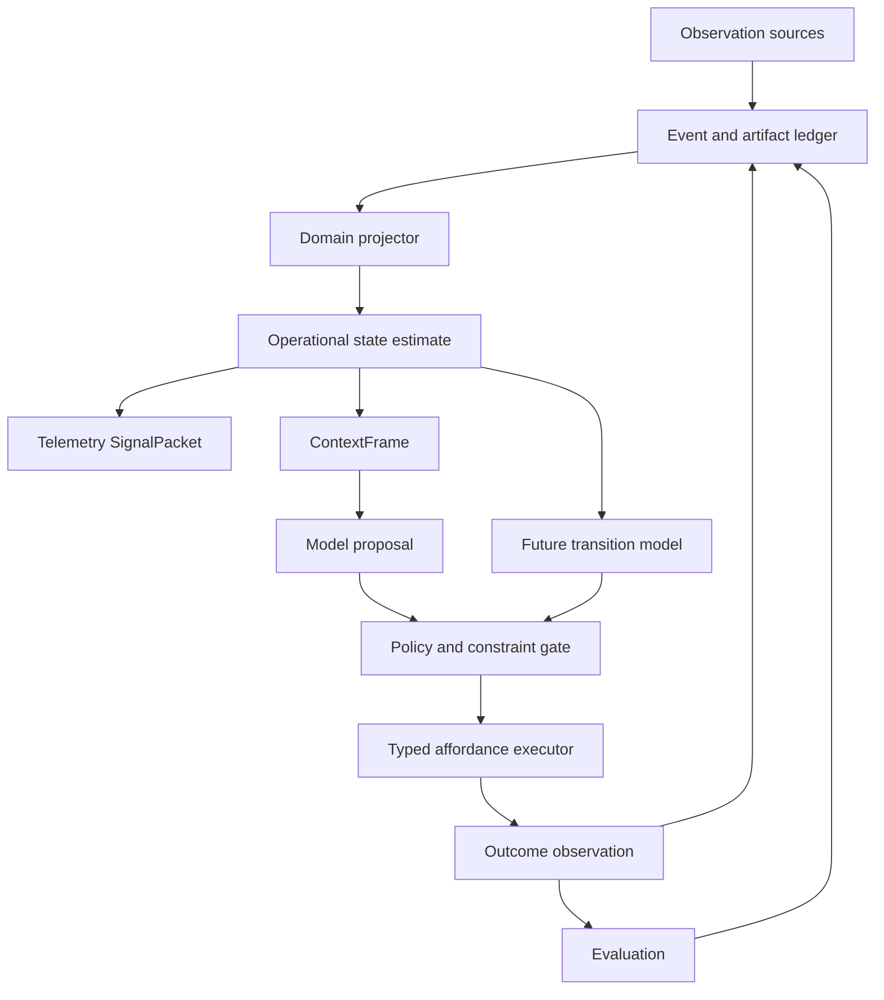

# Runtime Architecture

## Boundaries

Blackcell keeps one immutable evidence ledger and multiple domain-scoped projectors. A
repository, personal work queue, and telemetry system do not share one universal state
schema, transition model, action space, horizon, or objective. ContextFrames may compose
state estimates across domains, but prediction and control remain bounded by domain.



## Command, event, projection, and artifact separation

Commands request work and use imperative names. Events record accepted facts in past tense.
Projections are rebuildable views. Artifacts are immutable, content-addressed payloads.

| Category | Examples |
| --- | --- |
| Command | `IngestObservation`, `BuildContext`, `RequestDecision`, `ExecuteAction` |
| Event | `ObservationRecorded`, `PolicyEvaluated`, `ActionSucceeded`, `OutcomeObserved` |
| Projection | `OperationalStateEstimate`, `SignalPacket`, `RunTrace` |
| Artifact | ContextFrame, model request/response, tool result, evaluation report |
| Definition | `AffordanceDefinition`, `ConstraintDefinition`, `EvaluationSpec` |
| Runtime instance | `ActionProposal`, `PolicyDecision`, `ActionAttempt`, `EvaluationResult` |

## Event envelope

Every event occurrence has a unique event ID and a stream-local sequence. The envelope also
contains event and schema versions, recorded and effective times, source and actor,
correlation and causation IDs, payload hash, and an optional idempotency key.

An idempotency key identifies a retried command, not an event's identity. Repeated equivalent
observations are still separate occurrences unless they are proven retries of the same
ingestion request.

Appending uses optimistic expected-sequence checks. Projectors record their version and last
processed global sequence. Projection tables are disposable and rebuildable.

## Artifacts

Large or sensitive ContextFrames, prompts, responses, tool output, and reports are stored as
content-addressed artifacts. Events contain hashes and metadata rather than duplicating
content. Artifact reads verify the digest before returning bytes.

## Replay modes

Historical replay reads recorded events, model results, tool results, and artifacts. The
Phase 1 Repository Operator verifies every referenced artifact and independently rebuilds
the recorded operational-state projections to reproduce their content hashes. It never
calls an observer, live model, or executor and never repeats a side effect. Policy and grader
re-execution belongs to a later versioned replay contract; their recorded artifacts are
integrity-checked now.

Counterfactual rerun applies a current model, projector, policy, or grader to a historical
ContextFrame. It creates a new experiment and correlation ID. It is not deterministic replay.

## Action protocol

```text
ProposalRecorded
  -> PolicyEvaluated(allow | deny | require_approval)
  -> ActionObserved (allowed read-only path only)
  -> EvaluationRecorded
  -> StateTransitionCommitted
```

SQLite and an external side effect cannot share one atomic transaction. After a crash with an
unknown outcome, the executor reconciles the side effect before retrying. Phase 1 avoids most
of this complexity by exposing only read-only affordances.

## Model boundary

A `DecisionModel` receives one serialized ContextFrame and a response schema. It returns a
typed proposal. It has no direct tool access and no ambient authority. Blackcell owns policy,
approval, execution, and outcome recording.

`RecordedModel` supports deterministic CI and replay. `CodexExecModel` is an optional local
adapter that prepares a temporary Git workspace containing only the frame and schema and asks
the Codex CLI to use its read-only sandbox. Its process sandbox is provided by the CLI, not by
Blackcell.

## Observability boundary

Domain evidence and diagnostic telemetry remain separate. Stable internal spans include:

- `blackcell.observe`;
- `blackcell.state.project`;
- `blackcell.context.build`;
- `blackcell.model.decide`;
- `blackcell.policy.evaluate`;
- `blackcell.affordance.execute`;
- `blackcell.outcome.observe`;
- `blackcell.evaluation.grade`;
- `blackcell.transition.commit`.

Span attributes contain low-cardinality identifiers and versions. Prompt and evidence content
is artifact data governed by an explicit redaction policy. OpenTelemetry mapping is an
exporter concern and cannot define the domain schema.
