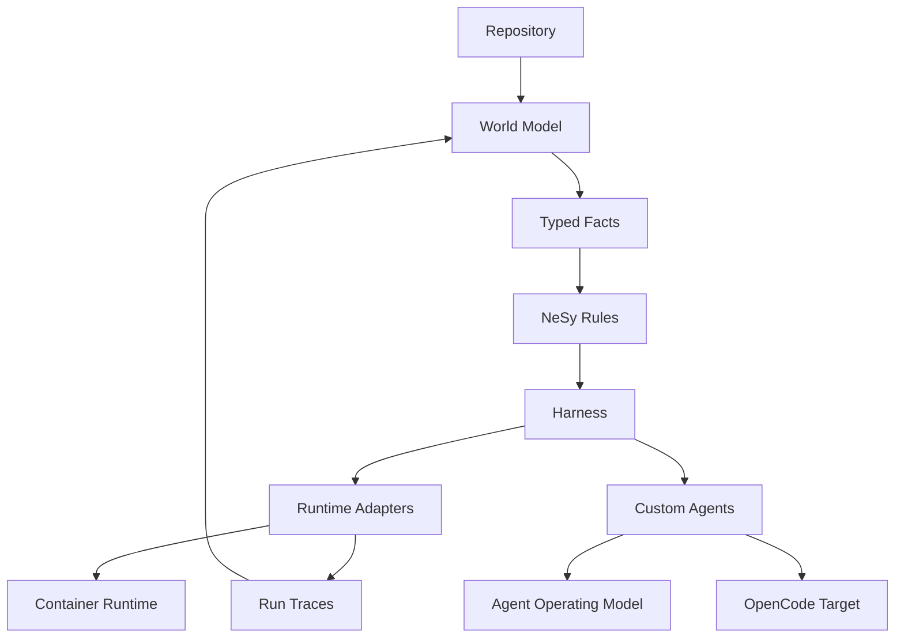

# Documentation Graph

## Node Families

- `atlas`: maps and vocabulary for navigating the graph
- `concepts`: stable project ideas and internal seams
- `targets`: generated or runtime-specific integration surfaces
- `research`: reference notes that inform future design
