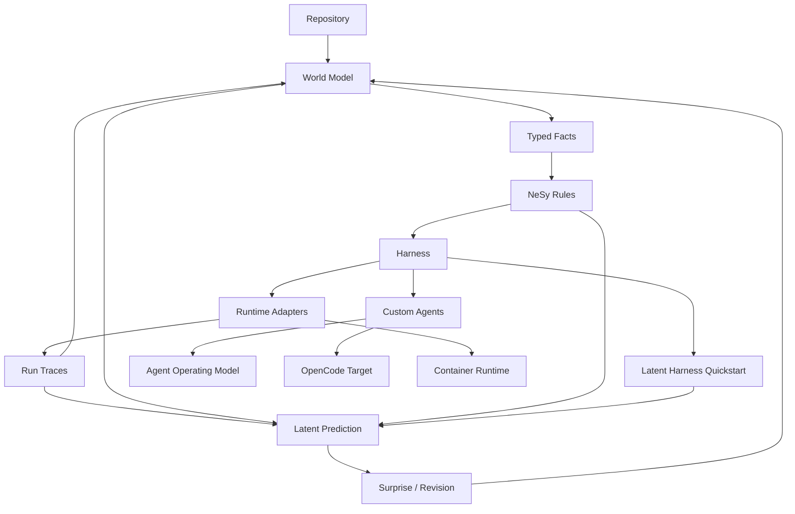

# Documentation Graph

## Node Families

- `atlas`: maps and vocabulary for navigating the graph
- `concepts`: stable project ideas and internal seams
- `guides`: user-facing workflows over stable concepts and specs
- `targets`: generated or runtime-specific integration surfaces
- `research`: reference notes that inform future design
- `spec`: durable implementation plans and BCP-sized roadmap nodes
