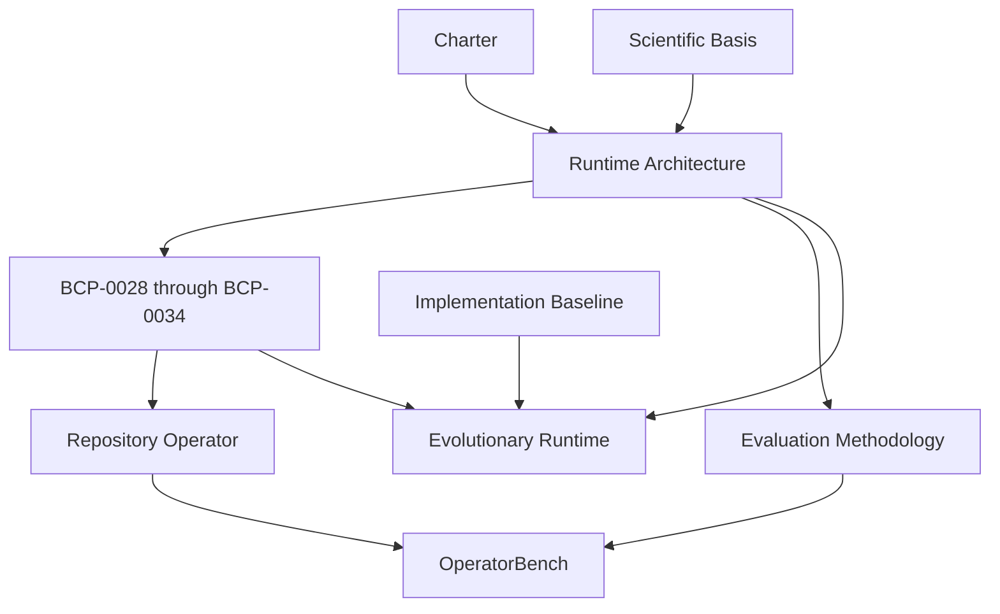

# Documentation Graph

## Node Families

- `charter`: product identity, scope, claim gates, and acceptance criteria
- `architecture`: stable event, state, context, policy, execution, and replay boundaries
- `research-contract`: terminology discipline and promotion rules
- `evaluation-contract`: scenarios, baselines, metrics, and trial protocol
- `adr`: accepted trade-offs and their consequences
- `spec`: bounded implementation slices
- `implementation-baseline` and `migration-ledger`: measured starting point and strangler map
- `concepts`, `guides`, `targets`, and `research`: retained prototype history
