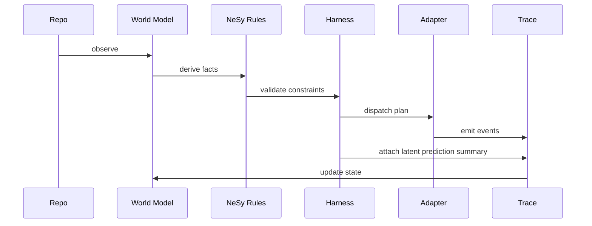

# Harness Runtime

The harness turns world state into an explicit plan and then dispatches that
plan through a runtime adapter.

## Core Objects

- `AgentSpec`: role, objective, sandbox posture
- `PlanStep`: a single step in the harness loop
- `HarnessPlan`: goal plus agents plus steps
- `RunTrace`: append-only record of what happened during dispatch

The dry-run harness also emits a compact latent prediction summary. When run
with `--latent-db <path>`, it records the simulated latent transition in the
local SQLite ledger and uses prior ledger transitions to label confidence.
Use `--show-stats` with `--latent-db` to fold action-level latent stats into the
same dry-run output.

`--latent off|summary|record|stats` controls this behavior explicitly. The older
`--latent-db` and `--show-stats` flags remain compatible shortcuts for `record`
and `stats` behavior.

For copy-paste commands and ledger inspection, see
`../guides/latent-harness-quickstart.md`.

## First Slice

The first slice includes a dry-run runtime only. That keeps the architecture
visible before the project commits to automation depth.

