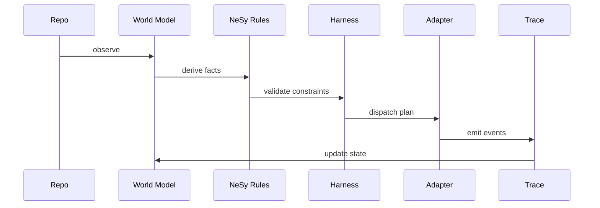

# Harness Runtime

The harness turns world state into an explicit plan and then dispatches that
plan through a runtime adapter.

## Core Objects

- `AgentSpec`: role, objective, sandbox posture
- `PlanStep`: a single step in the harness loop
- `HarnessPlan`: goal plus agents plus steps
- `RunTrace`: append-only record of what happened during dispatch

## First Slice

The first slice includes a dry-run runtime only. That keeps the architecture
visible before the project commits to automation depth.

