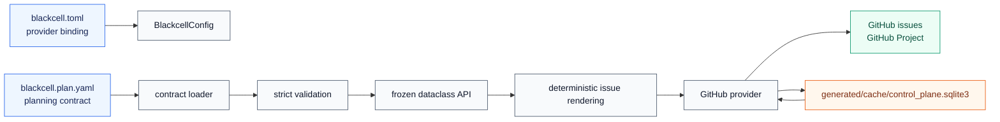
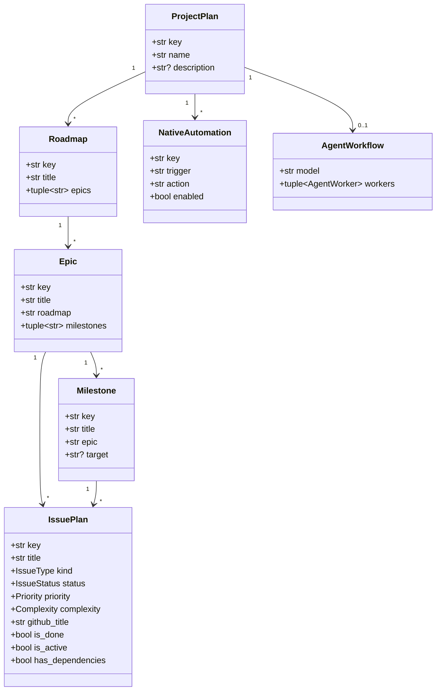
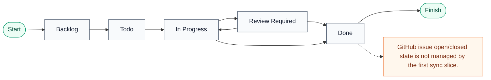
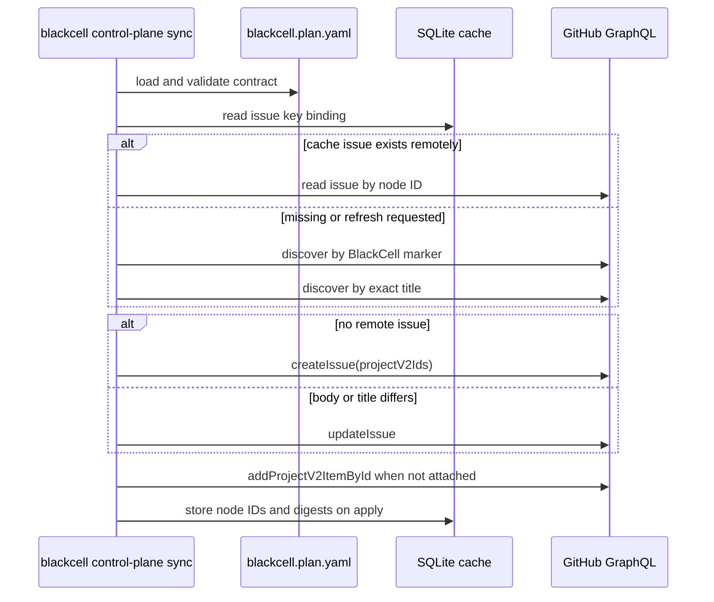

# Control Plane Configuration

BlackCell keeps provider binding and authored planning state separate.
`blackcell.toml` identifies the remote repository and GitHub Project. The
repo-authored planning API lives in `blackcell.plan.yaml` and is parsed into
frozen dataclasses under `blackcell.control_plane.models`.

## Configuration Sources



`blackcell.toml` should contain only provider state:

```toml
provider = "github"

[repository]
owner = "kmosoti"
name = "blackcell"
node_id = "R_123"

[project]
id = "PVT_123"
title = "BlackCell"
number = 7
url = "https://github.com/users/kmosoti/projects/7"
```

Remote issue IDs, issue numbers, Project item IDs, and sync digests are
generated operational state. They belong in
`generated/cache/control_plane.sqlite3`, not in `blackcell.plan.yaml`.

## Project Kinds

`blackcell.plan.yaml` models project structure with these planning node kinds:

| Kind | YAML key | Purpose |
| --- | --- | --- |
| Project | `project` | Top-level planning namespace and display name. |
| Roadmap | `roadmaps` | Long-running initiative that groups epics. |
| Epic | `epics` | Delivery area inside a roadmap. |
| Milestone | `milestones` | Target slice inside an epic. |
| Issue | `issues` | Work contract rendered to a GitHub issue. |
| Native automation | `native_automation` | Repo-local command hooks such as validation before sync. |
| Agent workflow | `agent_workflow` | Agent ownership and model routing metadata. |



## Issue Kinds

Issue kinds are represented by the `IssueType` enum and configured with the
`type` field:

| Kind | YAML value | Intended use |
| --- | --- | --- |
| Feature | `feature` | New user-visible or platform capability. |
| Bug | `bug` | Defect fix or regression repair. |
| Refactor | `refactor` | Behavior-preserving structural change. |
| Chore | `chore` | Maintenance, dependency, tooling, or housekeeping work. |

The `IssuePlan` dataclass is frozen and slot-backed. Its constructor fields are
the YAML contract API; parser helpers such as `_issue`, `_enum`, and
`_reject_unknown` are private module internals. Public computed properties are
kept small and stable:

| Property | Meaning |
| --- | --- |
| `kind` | Alias for `type`, used by callers that describe issue categories as kinds. |
| `github_title` | Remote GitHub issue title. This is intentionally the contract title without a key prefix. |
| `is_done` | True when status is `Done`. |
| `is_active` | True for `In Progress` or `Review Required`. |
| `is_backlog` | True when status is `Backlog`. |
| `has_dependencies` | True when `depends_on` contains at least one issue key. |
| `has_scope` | True when local scope entries are configured. |
| `has_delivery_contract` | True when change spec or local ready/done/acceptance criteria exist. |
| `hierarchy_keys` | Ordered non-empty `epic` and `milestone` references. |

## Issue Configuration

```yaml
issues:
  - key: BCP-0001
    title: Define the durable planning contract
    type: feature
    status: Todo
    priority: P0
    complexity: 5
    epic: EPIC-CONTROL-PLANE
    milestone: MS-CP-1
    depends_on:
      - BCP-0000
    areas_of_responsibility:
      - contract/schema
    scope:
      - Add typed dataclasses and strict enum parsing.
    context:
      - blackcell.plan.yaml is repo-authored planning state.
    change_spec:
      - Add contract models and validators.
    acceptance_criteria:
      - Invalid enum values fail during contract load.
    definition_of_ready:
      - Scope and acceptance criteria are present.
    definition_of_done:
      - Unit tests cover success and failure paths.
```

Required fields are `key`, `title`, `type`, `status`, `priority`, and
`complexity`. Optional sequence fields default to empty immutable tuples.
Unknown fields are rejected during load.



## Sync Materialization

`blackcell control-plane sync` is local-to-GitHub and dry-run by default.
`--apply` creates or updates GitHub issues and ensures each issue is attached to
the configured GitHub Project. Project field values such as Status, Priority,
Complexity, and Type are intentionally deferred.


