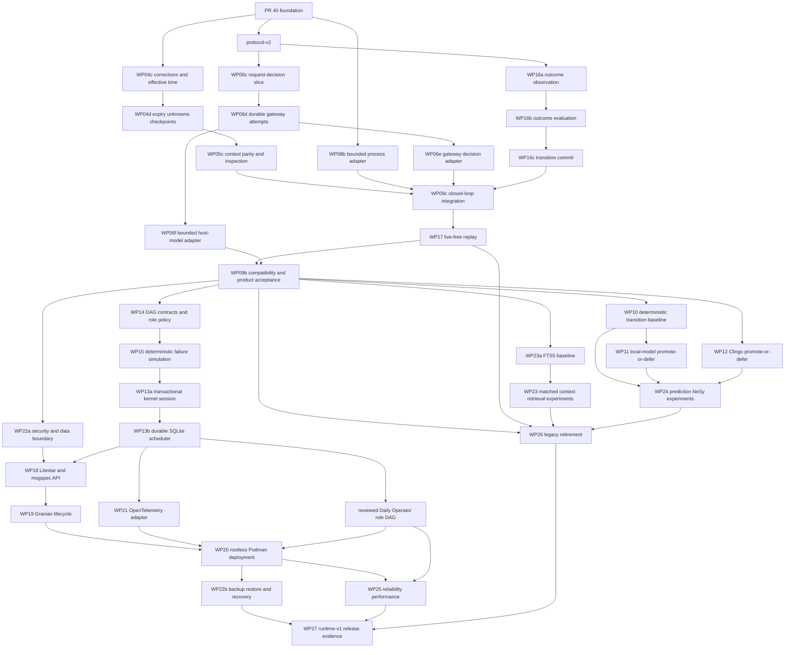

# BCP-0034: Evolutionary Agentic Runtime

Status: active — WP06f, WP09b-WP09c, and WP17 compose the public Repository Operator, bounded
host-model, scoped state/context, gateway, artifact-first execution, independent outcome
evaluation, transition, and live-free replay around one canonical `daily-operator/v2` application
workflow. Runtime-v1 continues as one dependency DAG on one integration branch and one pull
request.

`DailyOperatorV2Workflow` now records one create-only causal run from immutable request and
evaluation policy through gateway decision, symbolic authorization, journaled execution,
independent outcome observation, deterministic evaluation, evidence-scoped transition acceptance,
verified trace, and terminal result. Duplicate delivery is rejected before live work, unresolved
model or execution attempts remain fail-closed, and definitive failed-goal evidence is preserved
rather than discarded.

`ReplayRunHandler` now dispatches recorded `daily-operator/v1` and `daily-operator/v2` histories
through history-reader, protocol-decoder, artifact-verifier, and projection-verifier ports only.
It distinguishes completed, failed, interrupted, and corrupt history from the material run
outcome, verifies exact v2 journal and state evidence, reports absent v1 state snapshots as not
recorded, and performs no write or live call. This establishes an integrated closed loop and
historical replay contract. WP09b now joins it to the public Repository Operator and CLI: live runs
are composed once through the v2 workflow, and replay remains a separate read-only capability.

`CodexCliModelAdapter` supplies the bounded host-model edge for that join. It receives the exact
gateway-selected model and admitted deadline, writes only canonical input and schema documents to
an isolated temporary Git workspace, fixes Codex approval and sandbox posture, bounds every
captured output surface, and reports exact usage without exposing request or provider content.
Gateway policy still owns classification, locality, determinism, budgets, and final schema
validation; the adapter cannot grant tools or affordances.

The WP09b product facade owns only composition, repository-scoped lookup, and compact rendering.
Its initial source, read-only executor, and post-execution observer each use the same bounded Git
status reader through separate calls; executor output is never treated as evaluation evidence.
Persisted status manifests contain typed booleans, counts, and digests rather than raw paths. The
recorded route is local and deterministic, while the Codex route is remote, nondeterministic, and
requires an explicit model ID before any storage or host-model call.

## Outcome

Evolve the working Repository Operator into a stateful, observable agentic runtime with one event
kernel, vertical feature slices, a capability-based model gateway, durable DAG orchestration,
advisory transition prediction, symbolic constraint solving, replayable evaluation, an operator
API, and a rootless Podman deployment.

## Target source tree

```text
src/blackcell/
├── kernel/                 # identity, envelopes, provenance, time, transactions
├── features/
│   ├── ingest_observation/
│   ├── project_operational_state/
│   ├── derive_signal_packet/
│   ├── retrieve_evidence/
│   ├── build_context/
│   ├── predict_transition/
│   ├── solve_constraints/
│   ├── authorize_action/
│   ├── execute_affordance/
│   ├── evaluate_outcome/
│   └── replay_run/
├── workflows/
│   └── daily_operator.py
├── gateway/                # model capabilities, routing, profiles, budgets, audit
├── orchestration/          # DAG contracts, scheduler, leases, fencing, roles
├── adapters/
│   ├── persistence/sqlite/
│   ├── retrieval/fts5/
│   ├── models/
│   │   ├── recorded/
│   │   ├── llama_cpp/
│   │   └── remote/
│   ├── reasoning/clingo/
│   ├── execution/local_process/
│   └── telemetry/otel/
├── interfaces/
│   ├── http/contracts/
│   ├── http/v1/
│   └── cli/
├── compatibility/          # temporary facades for old public paths
└── bootstrap/              # CLI, worker, HTTP composition roots
```

Each feature may start with `command.py`, `handler.py`, `events.py`, `projection.py`, and
`ports.py`, but it creates only the files its behavior needs. The tree is a boundary guide, not a
mandate for empty modules.

## Model gateway

All reasoning, coding, structured generation, and embedding requests pass through one gateway.
Agents request capabilities and constraints rather than importing provider clients or naming a
provider in domain code.

A gateway request contains:

- capability: `reason`, `code`, `review`, `verify`, or `embed`;
- typed input and required output schema;
- context and data-classification labels;
- latency, cost, token, and locality budgets;
- determinism and tool-use policy;
- correlation, causation, run, and node identifiers.

Routing profiles are configuration owned by Blackcell. A profile can choose a recorded model,
lightweight local model, llama.cpp server, subscription-backed command adapter, or remote API.
Model names—including any future `5.6 Terra` mapping—remain deployment configuration, not source
architecture. Requests and responses are immutable artifacts; the gateway emits correlated usage,
latency, routing, retry, and error events.

The gateway cannot grant affordances. Its typed output is a proposal consumed by policy and
constraint slices.

## Multi-agent DAG

The orchestration subsystem executes a typed directed acyclic graph whose nodes call workflows or
feature ports. The initial roles are:

| Role | Primary capability | Required independence |
| --- | --- | --- |
| planner | decompose goals and define acceptance evidence | cannot execute actions |
| executor | produce a bounded proposal or implementation artifact | cannot approve itself |
| reviewer | inspect correctness, design, and safety | receives evidence, not hidden executor state |
| verifier | run deterministic checks and compare acceptance criteria | deterministic checks precede model judgment |
| synthesizer | reconcile accepted outputs and unresolved uncertainty | cannot override a symbolic denial |

Nodes declare typed inputs, outputs, retry policy, timeout, budget, side-effect class, and required
approval. The durable scheduler records node readiness, attempts, leases, fencing tokens, results,
and terminal state. A worker must hold the current lease and fencing token before committing a node
result. At-least-once delivery is expected; handlers must be idempotent or reconcile uncertain
outcomes.

WP14 now makes the definition side executable as policy: DAG and node identities are canonical,
topological order is stable, input bindings must match producer output schemas, and role profiles
bound capability, classification, locality, determinism, effects, and approvals. Planner execution,
executor self-approval, remote or nondeterministic verification, irreversible scheduler authority,
cycles, missing edges, and schema drift fail before submission. WP13b persists and schedules only
definitions that pass this boundary; worker transport and handler dispatch remain separate ports.

WP15 exercises that definition boundary with a pure deterministic failure simulator. It accounts
for each attempt's token, latency, and cost usage; applies bounded retries; models worker loss,
stale completion, and duplicate delivery with fencing evidence; evaluates independent approvals;
blocks dependent nodes after terminal failure; and emits a content-addressed report with at most
one simulated commit per node. It deliberately does not dispatch workers or write scheduler state.

WP13a supplies the local atomicity seam required by that scheduler. A SQLite kernel session owns
one `BEGIN IMMEDIATE` boundary and gives adapters bounded DML plus caller-owned kernel event append
on the exact same connection. It rejects absent or foreign transactions and nested transaction
control, so a scheduler row cannot commit without its state-transition event or vice versa.

WP13b supplies the durable local scheduler. It reconstructs the canonical DAG after restart,
admits only dependency-ready and independently approved nodes, issues bounded leases with
monotonic fencing tokens, accounts cumulative usage, applies declared retry/backoff policy, and
recovers expired workers without replaying an external effect. Submission, approvals, and attempt
outcomes are content-idempotent; stale or divergent completions fail closed. Terminal failure or
denial blocks dependent work and fences other branches, while each state change and run terminal
decision appends causal, content-free kernel evidence in the same WP13a transaction.

## Predictive and neural-symbolic realism

Blackcell does not claim a learned world model in the initial runtime. `predict_transition` now
provides a deterministic state-persistence baseline over explicitly requested canonical facts.
Predictions carry source snapshot and action identity, horizon, confidence, assumptions,
claim/event provenance, and model version. A later same-stream canonical outcome state yields
typed match, mismatch, missing, conflict, or unscored findings plus exact-match and Brier measures.
Predictions and scores remain advisory DTOs and never become observations or accepted facts.
WP11 is explicitly deferred because no installed offline runtime, configured local prediction
route, or matched WP10 evaluation exists. Its machine-readable decision records the deployment,
gateway-boundary, calibration, latency, and resource-evidence prerequisites for reconsideration;
no speculative adapter or dependency is added.

`solve_constraints` keeps deterministic Python policy as its semantic reference and default. The
promoted Clingo 5.8 adapter sits behind the feature-owned solver port and independently checks each
decisive predicate after Blackcell has selected current evidence. It returns the exact reference
proofs and explanations on parity and fails closed without evidence content on drift or solver
failure. Freshness, conflicts, unknowns, provenance, proof identity, and authorization remain
Blackcell-owned; a denied constraint cannot be bypassed by model confidence or adapter selection.

Retrieval begins with SQLite FTS5 and provenance-preserving ranking. LightRAG or another graph/RAG
adapter may be evaluated only against the same retrieval port, scenarios, and context budget. It
does not own the operational belief state.

## API and deployment

Litestar owns HTTP transport and msgspec owns wire contracts. Granian serves the ASGI application.
Transport types do not enter feature packages. The initial API exposes health/readiness, observation
ingest, run submission and inspection, context inspection, approvals, events, replay, and evaluation.

WP18 integrates that edge as strict immutable msgspec contracts under `/api/v1`, translated by
Litestar into one injected application port. The concrete bootstrap adapter delegates to the
canonical Repository Operator, ingestion handler, event store, replay/evaluation evidence, and
durable scheduler instead of creating parallel behavior. Liveness and readiness are the only
public routes. Protected routes preserve raw ASGI header multiplicity and require explicit
read/run/approve scopes before body decoding. Responses and failures are bounded JSON; OpenAPI,
sessions, browser auth, proxy identity, and raw artifact access remain disabled. Service
composition creates the SQLite file owner-only before connecting. Submission remains synchronous
until the WP19 Granian lifecycle exists.

WP22a fixes the security boundary before that transport exists. Service startup requires an
absolute owner-only data root and exactly one opaque API credential from the environment or an
owner-only credential file. Framework-neutral authentication preserves header multiplicity,
accepts one strict Bearer value, and yields explicit read/run/approve/admin scopes without ambient
admin expansion. Bind defaults to loopback, forwarded-client trust is zero, and telemetry redacts
sensitive keys, credential shapes, and the exact configured secret before storage or export. ADR
0007 records the threat matrix and the TLS, federation, rotation, quota, and recovery limits.

The OCI image is Podman-compatible, runs as a non-root user, uses an explicit data volume, exposes
health checks, supports read-only root filesystems, and keeps provider credentials out of layers and
configuration committed to Git. The same image runs API and worker entry points.

## Work packages

| WP | Deliverable | Acceptance evidence |
| --- | --- | --- |
| 00 | measured baseline and migration ledger | baseline suite and remote branch |
| 01 | architecture ratification | ADR, target contracts, docs graph |
| 02 | dependency enforcement | AST/import tests and shrinking debt manifest |
| 03 | event kernel consolidation | transactional batch append, idempotency, replay tests |
| 04 | observation and state slices | characterized parity with repository projection |
| 05 | signal, retrieval, and context slices | provenance and context-budget tests |
| 06 | model gateway | capability routing, budgets, audit, recorded adapter |
| 07 | constraint and authorization slices | deterministic denial and proof artifacts |
| 08 | affordance execution slice | typed authority, approval, reconciliation tests |
| 09 | Daily Operator workflow and facades | old CLI behavior delegates to slices |
| 10 | transition prediction baseline | deterministic predictions scored against outcomes |
| 11 | local-model prediction adapter | offline/configurable adapter and matched evaluation |
| 12 | Clingo adapter | solver parity and explanation tests |
| 13 | durable DAG scheduler | leases, fencing, retries, recovery, idempotency |
| 14 | role profiles and gateway policies | planner/executor/reviewer/verifier separation |
| 15 | simulation and boundary review | failure matrix, token/latency/cost report |
| 16 | outcome evaluation slice | goal, evidence, policy, transition measures |
| 17 | replay and counterfactual separation | proof that replay has no live dependency path |
| 18 | Litestar/msgspec API | versioned contracts and API tests |
| 19 | Granian bootstrap | lifecycle, graceful shutdown, worker/API modes |
| 20 | Podman image and compose contract | rootless, health, volume, read-only tests |
| 21 | OpenTelemetry adapter | stable spans, redaction, trace correlation |
| 22 | recovery and security | backup/restore, secrets, quotas, threat model |
| 23 | comparative context/retrieval experiments | matched budgets, ablations, limitations |
| 24 | prediction/NeSy experiments | calibration and hybrid-vs-neural baseline |
| 25 | performance and reliability benchmark | profiling before optimization |
| 26 | legacy retirement | no dual stores or obsolete coordination paths |
| 27 | release evidence | docs, examples, SBOM, reproducible verification |

## Runtime-v1 continuous execution DAG

Work-package identifiers remain stable. Lettered suffixes split broad packages into reviewable
commits without inventing new product taxonomies. Dependencies control execution; joins trigger
automated verification and independent review, not a user approval pause.



### Remaining bounded nodes

| Node | Deliverable | Acceptance evidence |
| --- | --- | --- |
| WP23a | FTS5 baseline | matched retrieval evidence and explicit promote-or-defer record |
| WP19-WP22b | Granian, OTel, Podman, recovery | lifecycle gates, non-root image, durable restore |
| WP23-WP27 | experiments, profiling, retirement, release evidence | matched ablations, no dual writes, SBOM and reproducible verification |

The landed dependency join includes protocol-v2, WP04c-WP05c, WP06c-WP06f, WP08b, WP09b-WP09c,
WP10, WP12-WP15, WP16a-WP16c, WP17, WP18, and WP22a. WP09b is the product-accepted public composition over those
integrated contracts; WP10 consumes its recorded initial/outcome state and action identities
without entering the product control path, while WP12 remains an explicitly injected policy-edge
adapter.

## Delivery and review protocol

- Use `agent/runtime-v1` and one draft PR based directly on merged `main`. Keep each bounded node
  or review repair as a logically isolated commit; do not create stacked branches or PRs.
- Publish every completed node. Never rebase or force-push the published integration branch.
- The root integrator alone owns commits and shared hotspots. Parallel executors receive disjoint
  paths; reviewers and verifiers are read-only.
- Track maturity as **contract complete**, **integrated**, or **product accepted**. Unit tests alone
  establish a contract, not an integrated runtime or accepted product slice.
- Every high-consequence boundary declares its invariant and adversarial matrix before merge. At a
  minimum cover identity collisions and retries, zero and asymmetric budgets, multiple required
  items at exact limits, stale/conflicting/missing evidence, duplicate delivery and restart, and
  replay traps that would call a live dependency.
- Run focused regressions, the full test suite, Ruff, formatting, and `ty` for every commit set.
  Add property/state-machine and mutation tests where example tests can pass while the invariant is
  still wrong.
- Update this specification and the migration ledger in the same PR as behavior. Publish the branch
  after every isolated commit so review never depends on unpublished local ancestry.
- A confidence drop holds only the affected node. An independent subagent reviews the diff against
  this specification, an adversarial verifier checks the relevant invariants, repairs are committed,
  and unaffected DAG nodes continue. Routine dependency joins never request user confirmation.

## Phase 1 product acceptance

- one command executes the gateway-backed observe-to-transition Repository Operator loop;
- every material claim and ContextFrame decision has inspectable provenance;
- replay verifies artifacts and performs no live model call, observation, or side effect;
- a developer-authored symbolic constraint rejects at least one neural proposal;
- human correction appends evidence instead of rewriting history;
- expected and independently observed effects produce a typed evaluation.

## Runtime-v1 program acceptance

- model selection is gateway policy rather than agent-owned configuration;
- a multi-agent DAG survives worker restart without duplicate committed effects;
- prediction quality is measured and described without a learned-world-model claim;
- API and CLI share the same application use cases;
- the OCI image runs rootless under Podman with durable local state;
- evaluation reports quality, uncertainty, latency, tokens, and cost by run and node.
