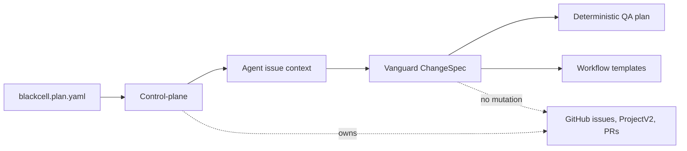
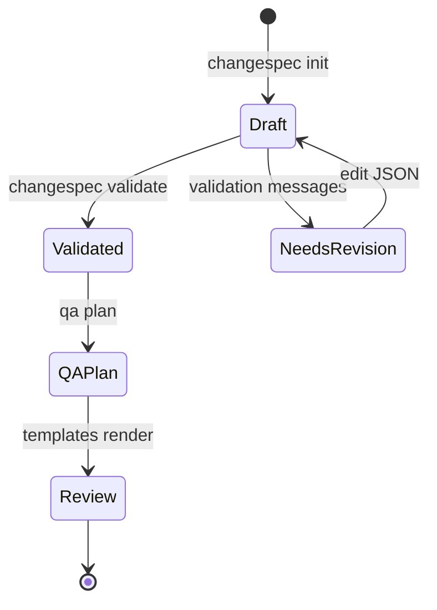

# Vanguard

Vanguard is a spec-first QA workflow layer under the existing BlackCell CLI:

```bash
uv run blackcell vanguard changespec init --issue-key BCP-0006
uv run blackcell vanguard changespec validate changespec.json
uv run blackcell vanguard qa plan changespec.json
uv run blackcell vanguard templates render
```

The control-plane remains the owner of project state, GitHub issue projection,
GitHub ProjectV2 fields, pull request workflow state, and remote mutations.
Vanguard consumes control-plane issue context and owns only issue-bound
ChangeSpec drafting, validation, deterministic QA planning, and review
templates.

Candidate invariants are evidence. They are not approved behavior, and Vanguard
does not infer `behavior_contract` entries from them. Evidence gathering and
review guidance are read-only. QA planning renders commands; it does not execute
them.

## Boundary



## ChangeSpec Lifecycle



## Invariants

- Control-plane commands are still responsible for GitHub sync, ProjectV2 field
  projection, PR workflow transitions, and any future remote state changes.
- Vanguard commands are read-only and deterministic.
- `qa plan` emits command records only; it does not run formatters, linters,
  tests, Git, GitHub CLI, or BlackCell mutating commands.
- Reviewer and tool-runner verification rejects fix-mode commands, snapshot
  updates, commits, pushes, merges, issue-closing commands, and BlackCell
  `--apply` workflows.
